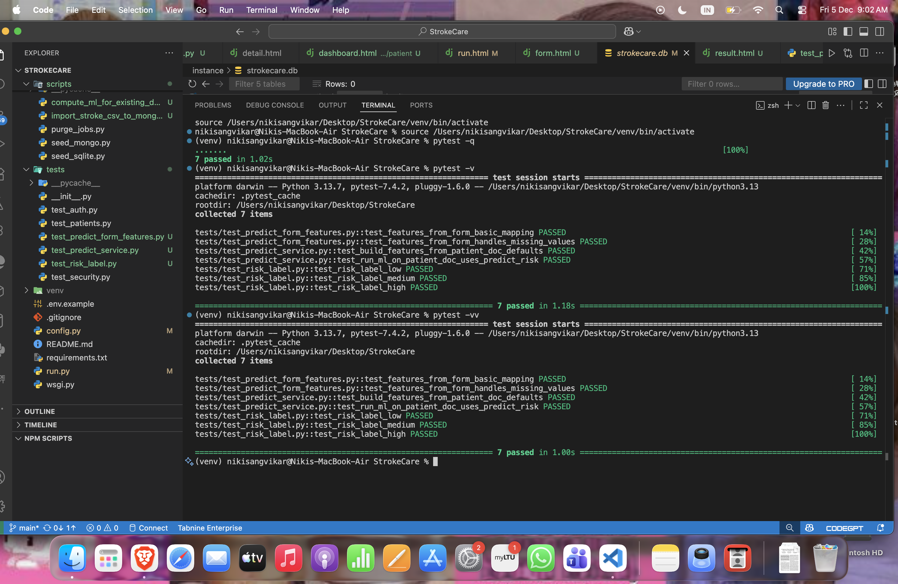
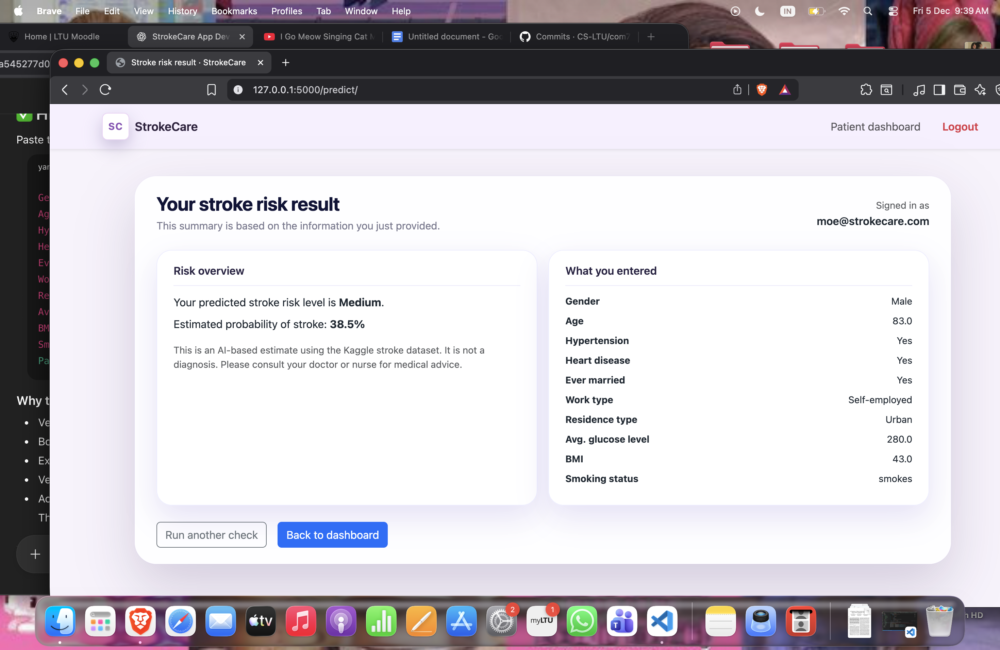
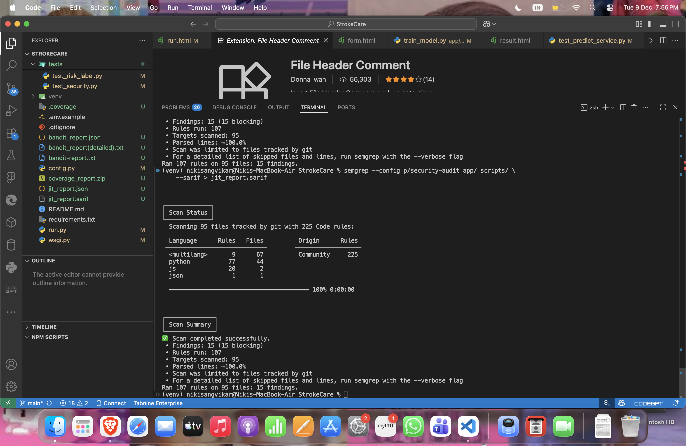
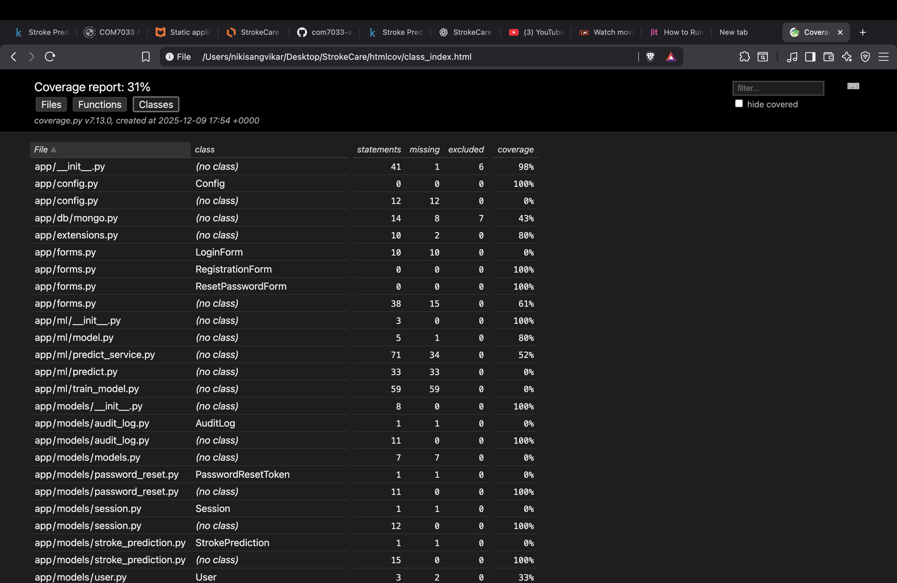
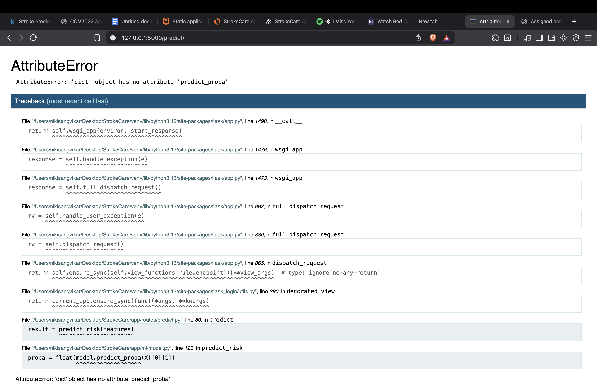
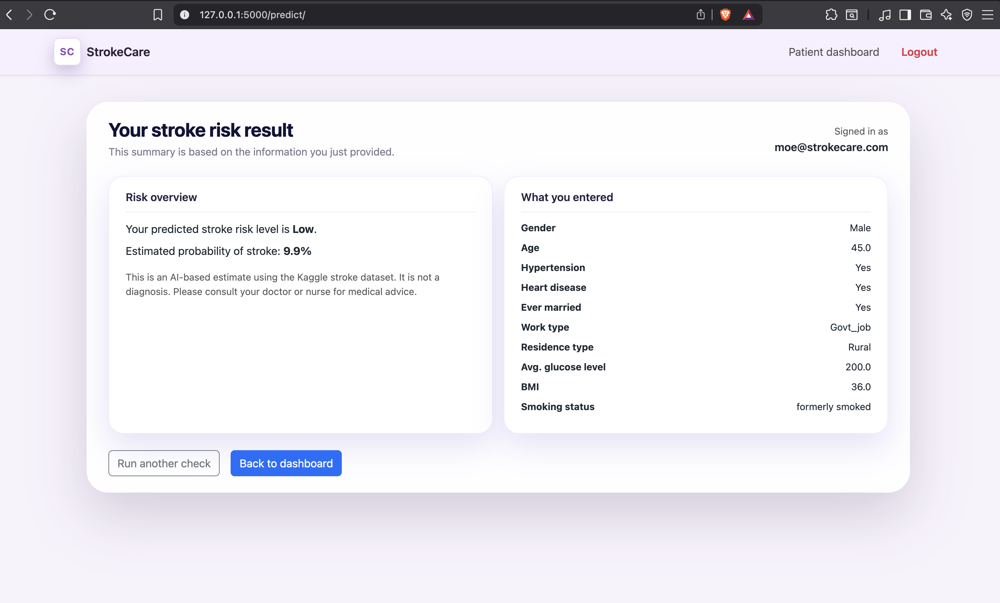

# StrokeCare — Secure Stroke Prediction & Patient Management System  
**Module:** COM7033 – Secure Software Development  
**Student ID:** 2415083  

---

## 1. About the Project

**StrokeCare** is a secure web-based application developed using **Python Flask** to support hospitals and healthcare professionals in managing patient data related to **stroke risk assessment and prevention**.

The system enables authorised users to securely:
- Record and manage patient demographic, lifestyle, and medical information
- Predict stroke risk using a machine learning model
- Maintain ethical, secure, and professional handling of sensitive healthcare data

Stroke is recognised by the **World Health Organization (WHO)** as the second leading cause of death globally. Early identification of high-risk patients is critical for preventative healthcare. StrokeCare addresses this challenge by integrating **secure software design**, **data-driven prediction**, and **role-based access control** into a single platform.

The application has been developed in alignment with the **COM7033 Assessment 1 Brief**, demonstrating:
- Secure programming practices
- CRUD functionality
- Multi-database architecture (SQLite + MongoDB)
- Ethical and professional software development
- Testing and version control using GitHub

---

## 2. Problems the Application Aims to Solve

### 2.1 Fragmented Clinical Data Systems
Many healthcare environments rely on general-purpose record systems that are not specialised for stroke risk assessment. This can lead to:
- Disconnected data sources
- Increased cognitive load on clinicians
- Delayed identification of high-risk patients

### 2.2 Manual and Error-Prone Processes
Traditional approaches such as paper forms or spreadsheets:
- Are vulnerable to data loss and human error
- Do not validate inputs consistently
- Cannot provide automated clinical decision support

### 2.3 Lack of Predictive Support
Stroke risk assessment often requires clinicians to manually interpret multiple variables (e.g. age, BMI, glucose levels, hypertension), which can be time-consuming and inconsistent.

### 2.4 Security and Privacy Risks
Without strong authentication, access control, and secure data handling, patient information is vulnerable to:
- Unauthorised access
- Data leakage
- Compliance failures

StrokeCare addresses these issues by providing a **centralised, secure, and predictive system** designed specifically for stroke-related healthcare workflows.


---

## 3. Stakeholders and Intended Users

StrokeCare has been designed for the following stakeholders:

### 3.1 Patients
- Indirect beneficiaries of the system
- Benefit from improved accuracy, early risk detection, and secure handling of their medical data
- No direct access to the application

### 3.2 Healthcare Professionals (HCPs)
- View patient records relevant to their role
- Support clinical workflows without unnecessary access to sensitive administrative controls

### 3.3 Doctors
- Perform full CRUD operations on patient data
- View machine learning–based stroke risk predictions
- Update patient records and reassess risk dynamically

### 3.4 Administrators
- Manage user accounts and roles
- Enforce role-based access control
- Maintain system integrity and security

---

## 4. Installation and Setup

### 4.1 Prerequisites
- Python 3.10+
- MongoDB (local or cloud instance)
- Git

## 4.2 Installation Steps

Follow the steps below to install the application locally.

### Step 1: Clone the repository

```bash
git clone https://github.com/CS-LTU/com7033-assignment-Vishbvs666
cd StrokeCare
```
### Step 2: Create and activate a virtual environment

```bash
python3 -m venv venv
source venv/bin/activate   # macOS / Linux
# venv\Scripts\activate    # Windows

```
### Step 3: Install project dependencies

```bash
pip install -r requirements.txt
```

## 4.3 Configuration

Application configuration is stored securely in the following file:

- instance/config.py

This file contains sensitive information such as:

- database connection details

- secret keys

- environment-specific settings

All sensitive configuration is separated from the main source code, reducing the risk of accidental exposure and supporting secure software development practices.

## 4.4 Running the Application

Follow the steps below to start the Flask application.

Step 1: Start the server
```bash

python run.py
```

Once the server is running, open a web browser and navigate to:
```bash
http://127.0.0.1:5000
```

## 4.5 Tools, Technologies, and Frameworks Used

The StrokeCare application was developed using a combination of modern backend frameworks, frontend technologies, machine learning libraries, databases, and security/testing tools. Each 
tool was selected to support secure software development, maintainability, and alignment with healthcare-oriented application requirements.

### Backend and Web Frameworks
- **Flask (Python)** – Used as the core web framework to implement routing, authentication, role-based access control, and application logic in a lightweight and modular manner.
- **Flask-Login** – Manages user authentication, session handling, and secure login/logout functionality.
- **Flask-WTF** – Provides secure form handling with built-in CSRF protection and input validation.
- **Jinja2** – Template engine used to safely render dynamic HTML content with automatic output escaping.

### Frontend Technologies
- **HTML5 / CSS3 / JavaScript** – Used to build responsive and interactive user interfaces.
- **Bootstrap 5** – Provides a consistent, professional UI layout with responsive components suitable for healthcare environments.
- **Chart.js** – Used for data visualisation, including risk distribution charts and analytics dashboards.

### Databases and Data Storage
- **SQLite** – Used for storing user authentication data such as credentials, roles, and session information.
- **MongoDB** – Used for storing patient records, clinical attributes, and machine learning prediction results.
- **Separation of Databases** – Authentication data and patient medical data are stored in separate databases to improve security and enforce separation of concerns.

### Machine Learning and Data Processing
- **scikit-learn** – Used to train the stroke risk prediction model, specifically implementing a **Random Forest Classifier**.
- **pandas & NumPy** – Used for data cleaning, preprocessing, feature engineering, and numerical computation during model training.
- **joblib** – Used to serialise and load the trained machine learning model into the Flask application for inference.
- **Kaggle Stroke Prediction Dataset** – A publicly available, anonymised dataset used for model training and evaluation:  
  https://www.kaggle.com/datasets/fedesoriano/stroke-prediction-dataset/data

### Security and Compliance Tooling
- **Werkzeug Security Utilities** – Used for secure password hashing and verification.
- **Custom RBAC Middleware** – Implements role-based access control across application routes.
- **Security Headers Configuration** – Applied to reduce exposure to common web-based attacks.
- **Audit Logging Utilities** – Track security-relevant user actions and system events.

### Testing, Quality Assurance, and Analysis
- **pytest** – Used for unit and integration testing of authentication flows, patient management, and prediction logic.
- **coverage.py** – Measures test coverage to ensure critical code paths are exercised.
- **Bandit** – Static Application Security Testing (SAST) tool used to identify potential Python security issues.
- **JIT Security Scanning** – Used to generate additional security analysis and SARIF reports for secure development evidence.

### Development and Version Control
- **Git & GitHub** – Used for version control, collaboration, and secure source code management.
- **Python Virtual Environment (venv)** – Isolates project dependencies and ensures reproducible builds.
- **VS Code** – Primary development environment for coding, testing, and debugging.

This combination of tools and frameworks enabled the development of a secure, modular, and extensible healthcare-oriented web application while supporting best practices in secure software development and machine learning integration.


---

## 5. System Architecture Overview

StrokeCare is designed using a **modular, layered architecture** that follows secure software development principles and supports scalability, maintainability, and data protection. The system separates responsibilities across the user interface, application logic, data storage, and machine learning components to minimise risk and improve clarity.

At a high level, the application consists of:
- A web-based user interface for hospital staff
- A Flask back-end that handles business logic and security
- Two separate databases for authentication and patient data
- An integrated machine learning model for stroke risk prediction

This separation ensures that sensitive data is handled securely while keeping the system easy to extend and maintain.

---

### 5.1 Presentation Layer (User Interface)

The presentation layer is responsible for all user interaction with the system. It is implemented using **HTML templates rendered by Flask**, styled with **Bootstrap** to ensure a clean, responsive, and professional interface suitable for healthcare environments.

Key responsibilities of this layer include:
- Displaying dashboards for different user roles (Admin, Doctor, HCP or Patient)
- Collecting user input through validated forms
- Presenting patient data and stroke risk results in a clear, readable format
- Preventing accidental actions through confirmation prompts

No business logic or database operations are handled directly in the user interface, reducing the risk of client-side security issues.

---

### 5.2 Application Layer (Flask Back-End)

The core logic of StrokeCare resides in the **Flask application layer**. This layer acts as a secure intermediary between the user interface, databases, and machine learning model.

Key responsibilities include:
- Handling HTTP requests and responses
- Enforcing authentication and role-based authorisation
- Validating and sanitising all user inputs
- Coordinating CRUD operations for users and patients
- Triggering stroke risk prediction when patient data changes

Flask Blueprints are used to organise functionality by role and feature, improving code readability and maintainability.

---

### 5.3 Authentication and Access Control

Authentication and access control are central to the system’s architecture.

- User authentication data (usernames, hashed passwords, roles) is stored in **SQLite**
- Passwords are securely hashed before storage
- Session-based authentication ensures that only logged-in users can access protected routes
- Role-based checks are applied at the route level to restrict access appropriately

This approach prevents unauthorised access and ensures that users can only perform actions relevant to their role.

---

### 5.4 Data Layer (Dual Database Design)

StrokeCare uses a **dual database architecture** to enhance security and follow best practices for sensitive systems.

#### SQLite — Authentication Database
SQLite is used exclusively for:
- User accounts
- Roles and permissions
- Authentication-related data

Keeping authentication data separate reduces the risk of exposure if patient records are compromised.

#### MongoDB — Patient Records Database
MongoDB is used for storing:
- Patient demographic information
- Lifestyle and medical history data
- Stroke risk prediction results

This document-based structure allows flexibility in patient records while supporting efficient updates and retrieval.

---

### 5.5 Machine Learning Integration

The machine learning component is integrated directly into the application layer.

- A **RandomForestClassifier** is trained offline using a public, anonymised dataset
- The trained model is saved and loaded into the Flask application at runtime
- When patient data is created or updated, the model processes the input and generates a stroke risk prediction
- The prediction output is categorised into clear risk levels and stored alongside patient records

This design allows predictive analytics to support clinical decision-making without exposing model complexity to end users.

---

### 5.6 Security-Oriented Design Decisions

Security considerations influence every layer of the architecture:
- Sensitive configuration is isolated from source code
- Databases are separated by function
- All inputs are validated before processing
- Sessions are managed securely
- No sensitive data is exposed through URLs or error messages

By embedding security into the architecture rather than treating it as an afterthought, StrokeCare aligns closely with secure software development life cycle (SSDLC) principles.

---

### 5.7 Architectural Benefits

This architecture provides several advantages:
- **Security:** Clear separation of concerns limits the impact of potential vulnerabilities
- **Scalability:** Components can be extended independently (e.g. replacing the ML model or database)
- **Maintainability:** Modular design improves readability and future development
- **Professionalism:** Reflects industry-aligned practices expected in healthcare software systems

---
### 5.8 File structure of the Project 

```bash
.
├── README.md
├── User Manual of StrokeCare.md
├── __pycache__
│   ├── config.cpython-313 2.pyc
│   └── config.cpython-313.pyc
├── add_headers.py
├── app
│   ├── __init__.py
│   ├── __pycache__
│   │   ├── __init__.cpython-313.pyc
│   │   ├── config.cpython-313.pyc
│   │   ├── extensions.cpython-313.pyc
│   │   ├── forms.cpython-313.pyc
│   │   ├── models.cpython-313.pyc
│   │   └── rbac.cpython-313.pyc
│   ├── auth
│   ├── config.py
│   ├── db
│   │   ├── __pycache__
│   │   │   └── mongo.cpython-313.pyc
│   │   └── mongo.py
│   ├── extensions.py
│   ├── forms.py
│   ├── ml
│   │   ├── __init__.py
│   │   ├── __pycache__
│   │   │   ├── __init__.cpython-313 2.pyc
│   │   │   ├── __init__.cpython-313.pyc
│   │   │   ├── model.cpython-313 2.pyc
│   │   │   ├── model.cpython-313.pyc
│   │   │   ├── predict.cpython-313.pyc
│   │   │   ├── predict_service.cpython-313 2.pyc
│   │   │   ├── predict_service.cpython-313.pyc
│   │   │   └── train_model.cpython-313.pyc
│   │   ├── model.py
│   │   ├── model_info.json
│   │   ├── predict.py
│   │   ├── predict_service.py
│   │   └── train_model.py
│   ├── models
│   │   ├── __init__.py
│   │   ├── __pycache__
│   │   │   ├── __init__.cpython-313 2.pyc
│   │   │   ├── __init__.cpython-313.pyc
│   │   │   ├── audit_log.cpython-313 2.pyc
│   │   │   ├── audit_log.cpython-313.pyc
│   │   │   ├── login_security.cpython-313.pyc
│   │   │   ├── models.cpython-313.pyc
│   │   │   ├── password_reset.cpython-313 2.pyc
│   │   │   ├── password_reset.cpython-313.pyc
│   │   │   ├── session.cpython-313 2.pyc
│   │   │   ├── session.cpython-313.pyc
│   │   │   ├── stroke_prediction.cpython-313 2.pyc
│   │   │   ├── stroke_prediction.cpython-313.pyc
│   │   │   ├── user.cpython-313 2.pyc
│   │   │   └── user.cpython-313.pyc
│   │   ├── audit_log.py
│   │   ├── login_security.py
│   │   ├── models.py
│   │   ├── password_reset.py
│   │   ├── session.py
│   │   ├── stroke_prediction.py
│   │   └── user.py
│   ├── models.py
│   ├── rbac.py
│   ├── routes
│   │   ├── __init__.py
│   │   ├── __pycache__
│   │   │   ├── __init__.cpython-313.pyc
│   │   │   ├── admin.cpython-313 2.pyc
│   │   │   ├── admin.cpython-313.pyc
│   │   │   ├── auth.cpython-313 2.pyc
│   │   │   ├── auth.cpython-313.pyc
│   │   │   ├── doctor.cpython-313.pyc
│   │   │   ├── hcp.cpython-313.pyc
│   │   │   ├── main.cpython-313.pyc
│   │   │   ├── patient.cpython-313 2.pyc
│   │   │   ├── patient.cpython-313.pyc
│   │   │   ├── patients.cpython-313.pyc
│   │   │   ├── predict.cpython-313 2.pyc
│   │   │   ├── predict.cpython-313.pyc
│   │   │   ├── privacy.cpython-313 2.pyc
│   │   │   └── privacy.cpython-313.pyc
│   │   ├── admin.py
│   │   ├── auth.py
│   │   ├── doctor.py
│   │   ├── hcp.py
│   │   ├── main.py
│   │   ├── patient.py
│   │   ├── patients.py
│   │   ├── predict.py
│   │   └── privacy.py
│   ├── static
│   │   ├── css
│   │   │   └── theme.css
│   │   ├── images
│   │   │   ├── logo.png
│   │   │   └── signin-image.jpg
│   │   └── js
│   │       ├── charts.js
│   │       └── dashboard.js
│   ├── templates
│   │   ├── _partials
│   │   │   └── navbar.html
│   │   ├── admin
│   │   │   ├── analytics.html
│   │   │   ├── audit_logs.html
│   │   │   ├── dashboard.html
│   │   │   ├── overview.html
│   │   │   ├── patient_form.html
│   │   │   ├── patients.html
│   │   │   ├── user_form.html
│   │   │   └── users.html
│   │   ├── auth
│   │   │   ├── __init__.py
│   │   │   ├── __pycache__
│   │   │   ├── forgot.html
│   │   │   ├── login.html
│   │   │   ├── register.html
│   │   │   └── reset.html
│   │   ├── base.html
│   │   ├── components
│   │   ├── dashboard
│   │   │   └── index.html
│   │   ├── doctor
│   │   │   ├── analytics.html
│   │   │   ├── dashboard.html
│   │   │   ├── patient_detail.html
│   │   │   ├── patient_new.html
│   │   │   └── patients.html
│   │   ├── hcp
│   │   │   ├── dashboard.html
│   │   │   ├── monitoring.html
│   │   │   ├── patient_detail.html
│   │   │   ├── patient_form.html
│   │   │   ├── patients.html
│   │   │   ├── patients_high.html
│   │   │   └── tasks.html
│   │   ├── main
│   │   │   └── coming_soon.html
│   │   ├── my
│   │   │   └── reports.html
│   │   ├── patient
│   │   │   ├── dashboard.html
│   │   │   ├── education.html
│   │   │   ├── predictions.html
│   │   │   └── profile.html
│   │   ├── patients
│   │   │   ├── detail.html
│   │   │   └── list.html
│   │   └── predict
│   │       ├── form.html
│   │       ├── result.html
│   │       └── run.html
│   └── utils
│       ├── __init__.py
│       ├── __pycache__
│       │   ├── __init__.cpython-313.pyc
│       │   ├── audit.cpython-313.pyc
│       │   ├── auth.cpython-313.pyc
│       │   ├── export.cpython-313.pyc
│       │   ├── metrics.cpython-313.pyc
│       │   ├── password_reset.cpython-313.pyc
│       │   ├── privacy.cpython-313.pyc
│       │   ├── purge.cpython-313.pyc
│       │   └── validators.cpython-313.pyc
│       ├── audit.py
│       ├── auth.py
│       ├── export.py
│       ├── metrics.py
│       ├── password_reset.py
│       ├── privacy.py
│       ├── purge.py
│       └── validators.py
├── bandit-report.txt
├── bandit_report(detailed).txt
├── bandit_report.json
├── config.py
├── coverage_report.zip
├── data
│   └── healthcare-dataset-stroke-data.csv
├── docs
│   └── images
│       ├── add_patient.png
│       ├── admin_analytics.pn.png
│       ├── admin_analytics.png
│       ├── admin_dashboard.png
│       ├── admin_patient_management.png
│       ├── doctor_add_patient.png
│       ├── doctor_analytics.png).png
│       ├── doctor_dashboard.png
│       ├── doctor_patient_detail.png
│       ├── doctor_patients.png
│       ├── hcp_add_patient.png).png
│       ├── hcp_assigned_patients.png
│       ├── hcp_dashboard.png
│       ├── hcp_high_risk.png
│       ├── hcp_monitoring.png
│       ├── hcp_patient_care.png
│       ├── hcp_tasks.png
│       ├── high_risk_patients.png
│       ├── login_page.png
│       ├── patient_dashboard.png
│       ├── patient_education.png
│       ├── patient_prediction_form.png
│       ├── patient_predictions.png
│       ├── patient_profile.png
│       ├── register_page.png
│       ├── stroke_prediction.png
│       └── user_management.png
├── github
│   └── copilot-context.md
├── htmlcov
│   ├── class_index.html
│   ├── coverage_html_cb_bcae5fc4.js
│   ├── favicon_32_cb_58284776.png
│   ├── function_index.html
│   ├── index.html
│   ├── keybd_closed_cb_ce680311.png
│   ├── status.json
│   ├── style_cb_a5a05ca4.css
│   ├── z_395c4f306d1419cf_mongo_py.html
│   ├── z_5f5a17c013354698___init___py.html
│   ├── z_5f5a17c013354698_config_py.html
│   ├── z_5f5a17c013354698_extensions_py.html
│   ├── z_5f5a17c013354698_forms_py.html
│   ├── z_5f5a17c013354698_models_py.html
│   ├── z_5f5a17c013354698_rate_limit_py.html
│   ├── z_5f5a17c013354698_rbac_py.html
│   ├── z_6c0e4b930745278b___init___py.html
│   ├── z_6c0e4b930745278b_audit_log_py.html
│   ├── z_6c0e4b930745278b_models_py.html
│   ├── z_6c0e4b930745278b_password_reset_py.html
│   ├── z_6c0e4b930745278b_session_py.html
│   ├── z_6c0e4b930745278b_stroke_prediction_py.html
│   ├── z_6c0e4b930745278b_user_py.html
│   ├── z_748a0465d46c2a16___init___py.html
│   ├── z_748a0465d46c2a16_audit_py.html
│   ├── z_748a0465d46c2a16_auth_py.html
│   ├── z_748a0465d46c2a16_export_py.html
│   ├── z_748a0465d46c2a16_metrics_py.html
│   ├── z_748a0465d46c2a16_password_reset_py.html
│   ├── z_748a0465d46c2a16_privacy_py.html
│   ├── z_748a0465d46c2a16_purge_py.html
│   ├── z_748a0465d46c2a16_validators_py.html
│   ├── z_84d4c024a05dd3c5___init___py.html
│   ├── z_84d4c024a05dd3c5_model_py.html
│   ├── z_84d4c024a05dd3c5_predict_py.html
│   ├── z_84d4c024a05dd3c5_predict_service_py.html
│   ├── z_84d4c024a05dd3c5_train_model_py.html
│   ├── z_aaaf4d6ac3ed1074_flash_html.html
│   ├── z_c6de83248c84ada5___init___py.html
│   ├── z_c6de83248c84ada5_admin_py.html
│   ├── z_c6de83248c84ada5_auth_py.html
│   ├── z_c6de83248c84ada5_doctor_py.html
│   ├── z_c6de83248c84ada5_hcp_py.html
│   ├── z_c6de83248c84ada5_main_py.html
│   ├── z_c6de83248c84ada5_patient_py.html
│   ├── z_c6de83248c84ada5_patients_py.html
│   ├── z_c6de83248c84ada5_predict_py.html
│   └── z_c6de83248c84ada5_privacy_py.html
├── instance
│   ├── stroke_model.joblib
│   └── strokecare.db
├── jit_report.json
├── jit_report.sarif
├── migrations
├── ml
│   ├── __init__.py
│   └── train_model.py
├── requirements.txt
├── run.py
├── scripts
│   ├── compute_ml_for_existing_docs.py
│   ├── dedupe_patients_by_original_id.py
│   ├── import_kaggle_with_ml.py
│   ├── import_stroke_csv_to_mongo.py
│   └── purge_jobs.py
├── tests
│   ├── __init__.py
│   ├── conftest.py
│   ├── test_auth.py
│   ├── test_patients.py
│   ├── test_predict_form_features.py
│   ├── test_predict_service.py
│   ├── test_risk_label.py
│   └── test_security.py
├── venv
│   ├── bin
│   │   ├── Activate.ps1
│   │   ├── activate
│   │   ├── activate.csh
│   │   ├── activate.fish
│   │   ├── alembic
│   │   ├── bandit
│   │   ├── bandit-baseline
│   │   ├── bandit-config-generator
│   │   ├── coverage
│   │   ├── coverage-3.13
│   │   ├── coverage3
│   │   ├── dotenv
│   │   ├── email_validator
│   │   ├── f2py
│   │   ├── flask
│   │   ├── glom
│   │   ├── httpx
│   │   ├── jsonschema
│   │   ├── mako-render
│   │   ├── markdown-it
│   │   ├── mcp
│   │   ├── normalizer
│   │   ├── numpy-config
│   │   ├── opentelemetry-bootstrap
│   │   ├── opentelemetry-instrument
│   │   ├── pip
│   │   ├── pip3
│   │   ├── pip3.13
│   │   ├── pwiz.py
│   │   ├── py.test
│   │   ├── pygmentize
│   │   ├── pysemgrep
│   │   ├── pytest
│   │   ├── python -> python3.13
│   │   ├── python3 -> python3.13
│   │   ├── python3.13 -> /opt/homebrew/opt/python@3.13/bin/python3.13
│   │   ├── semgrep
│   │   └── uvicorn
│   ├── include
│   │   └── python3.13
│   ├── lib
│   │   └── python3.13
│   │       └── site-packages
│   ├── pyvenv.cfg
│   └── share
│       └── man
│           └── man1
└── wsgi.py

```
---


## 6. Application Features

StrokeCare provides a range of secure, role-based features designed to support healthcare workflows while protecting sensitive data.

## 6.1 User Authentication Features

StrokeCare provides a secure and user-friendly authentication system that allows authorised hospital staff to safely access the platform. The authentication process consists of two main components: **User Registration** and **User Login**.

---

### 6.1.1 User Registration Page

The Registration page allows authorised healthcare staff to create a new StrokeCare account.


#### Purpose
The registration process ensures that only verified users with an assigned role can access sensitive system features.

#### How to Register
1. Open the **Register** page from the navigation bar.
2. Enter a valid professional email address.
3. Create a strong password and confirm it.
4. Select an appropriate user role (Admin, Doctor, or HCP).
5. Click **Create Account** to complete registration.

#### Key Characteristics
- Passwords are never stored in plain text and are securely hashed.
- Mandatory field validation prevents incomplete or incorrect submissions.
- Role selection determines the level of access granted after login.
- CSRF protection prevents unauthorised form submissions.

The registration page establishes the foundation for secure, role-based access throughout the system.

---

### 6.1.2 User Login Page

The Login page allows registered users to securely sign in and access the StrokeCare platform.


#### Purpose
The login process verifies user identity and ensures access is granted only to authorised users.

#### How to Log In
1. Navigate to the **Sign In** page.
2. Enter your registered email address.
3. Enter your password.
4. Complete the CAPTCHA verification.
5. Click **Sign In** to access the system.

#### Key Characteristics
- Secure session handling protects against unauthorised access.
- CAPTCHA verification reduces automated or malicious login attempts.
- Invalid login attempts are handled safely without revealing system details.
- Users are automatically redirected to their role-specific dashboard after successful login.

---

### 6.1.3 Role-Based Access After Authentication

After successful login, users are redirected based on their assigned role:

- **Admins** are directed to the Admin Dashboard for system management and monitoring.
- **Doctors** can access patient records and view stroke risk predictions.
- **HCPs (Healthcare Professionals)** have restricted, role-appropriate access to support clinical workflows.
- **Patients** do not access the system directly and benefit indirectly through secure data handling and improved clinical decision-making.

This role-based authentication model enforces the principle of **least privilege**, ensuring data confidentiality and system security.

---

## 6.2 Admin Features and Administration Panel

The Admin section of StrokeCare is designed to provide **full system oversight**, allowing authorised administrators to manage users, monitor activity, maintain patient records, and review system-wide analytics.

---

### 6.2.1 Admin Dashboard Overview

The Admin Dashboard provides a high-level summary of system activity and usage.


From this dashboard, administrators can:
- View the **total number of registered users**
- See how many users belong to each role (Admin, Doctor, HCP, Patient)
- Monitor the **total number of stroke risk predictions**
- Check recent system activity such as logins and logouts
- View the number of **active user sessions**

---

### 6.2.2 User Management

The User Management page allows administrators to manage all StrokeCare user accounts.


Administrators can:
- View all registered users in a single table
- See each user’s email address, assigned role, and active status
- Add new users using the **Add new user** button
- Edit existing user details (such as role or account status)
- Delete or deactivate accounts when access is no longer required

---

### 6.2.3 Patient Management (Admin Access)

Administrators also have access to patient records stored in the system for oversight and auditing purposes.


From this page, administrators can:
- View all patient records stored in MongoDB
- See key patient attributes such as age, gender, and hypertension status
- Identify whether a patient is flagged as having had a stroke in the dataset
- Edit or delete patient records if necessary
- Add new patient records using the **Add patient** option

---

### 6.2.4 Adding a New Patient Record

Administrators can manually add patient records using a structured form.


The form includes fields such as:
- Demographic details (age, gender, residence type)
- Lifestyle factors (smoking status, work type)
- Medical indicators (BMI, glucose level, hypertension)
- Dataset stroke flag (used for model training reference)

All inputs are validated before being saved, ensuring data consistency and integrity.

---

### 6.2.5 Analytics and Model Insights

The Analytics & Model Insights page provides visual summaries of system usage and prediction outcomes.


This section allows administrators to:
- Track the number of stroke risk predictions over time
- View the distribution of predicted risk levels (Low, Medium, High)
- Review the number of user accounts by role
- Understand how the system is being used across different user groups

---

### 6.2.6 Security and Administrative Responsibility

All Admin features are protected by:
- Role-based access control
- Secure session handling
- Input validation and confirmation prompts
- Restricted access to sensitive actions such as deletion

Administrators are responsible for maintaining system integrity, ensuring appropriate access, and supporting compliance with secure software development practices.

---

## 6.3 Doctor Features and Clinical Workflow

The Doctor role in StrokeCare is designed to support day-to-day clinical decision-making by providing secure access to patient records, stroke risk predictions, and analytical insights. Doctors can manage their patient caseload, identify high-risk individuals, and run new stroke risk assessments using the integrated prediction tool.

---

### 6.3.1 Doctor Dashboard Overview

The Doctor Dashboard provides a personalised overview of clinical activity.


From this dashboard, doctors can:
- View the total number of patients under their care
- See how many patients are currently classified as high risk
- Track how many stroke risk predictions they have run
- View predictions generated on the current day
- Review a table of recent prediction activity

Quick action buttons allow doctors to immediately:
- View all patients
- View only high-risk patients
- Run a new stroke risk prediction
- Access personal analytics and activity summaries

This dashboard acts as the central hub for clinical interactions within StrokeCare.

---

### 6.3.2 Patient List and Search

The Patients page allows doctors to view and manage patient records imported from the stroke dataset.


Doctors can:
- View a structured list of patients along with their risk level and risk score
- Search patients using attributes such as ID, gender, work type, or smoking status
- Navigate directly to an individual patient’s detailed record

This enables efficient patient lookup and prioritisation in clinical workflows.

---

### 6.3.3 Risk Filtering and High-Risk Patients

Doctors can filter patients based on stroke risk level using the **Risk filter** option.


Key capabilities include:
- Filtering patients by Low, Medium, or High risk
- Viewing a dedicated **High Risk Patients** list
- Quickly identifying patients requiring immediate attention

This feature helps clinicians focus on patients with elevated stroke risk and supports proactive intervention.

---

### 6.3.4 Exporting Patient Data (CSV)

The patient list supports exporting filtered data as a CSV file.

Doctors can:
- Apply search and risk filters
- Click **Export CSV** to download the currently displayed patient data
- Use exported data for offline review, reporting, or audit purposes

The exported file reflects the active filters, ensuring that only relevant patient records are included.

---

### 6.3.5 Adding a New Patient Record

Doctors can add new patients to their caseload using a structured input form.


The form captures:
- Demographic information (name, age, gender, residence)
- Lifestyle factors (smoking status, work type)
- Medical indicators (BMI, glucose level, hypertension, heart disease)
- Dataset stroke flag (for reference and validation)

All inputs are validated before submission to ensure data quality and consistency.

---

### 6.3.6 Viewing and Managing an Individual Patient Record

Each patient record includes a detailed, read-only view of imported demographic and medical data.


Doctors can:
- Review patient history and risk factors
- View the model-generated risk level and numeric risk score
- Update the risk label where appropriate (for demonstration or review purposes)
- Archive patient records using a soft-delete mechanism

Archiving hides the patient from active lists without permanently deleting the record, supporting safe data management.

---

### 6.3.7 Running a New Stroke Risk Prediction

Doctors can manually run a stroke risk assessment using the prediction tool.


To run a prediction:
1. Enter the patient’s health and lifestyle details.
2. Optionally provide a patient identifier.
3. Click **Run stroke risk check**.

The system processes the input using the trained machine learning model and returns:
- A predicted risk category (Low, Medium, or High)
- An associated numeric risk score

This tool supports clinical assessment and early risk identification.

---

### 6.3.8 Doctor Analytics and Activity

The Analytics & Activity page provides doctors with a personal summary of their system usage.


This page displays:
- Total predictions triggered by the doctor
- Number of high-risk predictions
- Count of patients with at least one prediction
- A table of recent prediction timestamps

These insights help doctors understand their usage patterns and clinical activity within StrokeCare.

---

### Summary

The Doctor module is designed to balance usability and clinical responsibility. By combining patient management, risk filtering, prediction tools, and export functionality, StrokeCare supports informed decision-making while maintaining strong security and role-based access controls.

## 6.4 Healthcare Professional (HCP) Features and Clinical Workflow

The Healthcare Professional (HCP) role in StrokeCare is designed to support day-to-day patient care activities while maintaining strict role-based access controls. HCPs assist doctors by managing assigned patients, completing routine care tasks, monitoring risk alerts, and documenting observations, without direct access to administrative or model-level controls.

---

### 6.4.1 HCP Dashboard Overview

The HCP Dashboard provides an operational overview of patient care responsibilities.


From this dashboard, HCPs can:
- View the total number of patients assigned to their care
- See how many assigned patients are currently classified as high risk
- Track tasks scheduled for the current shift
- Review care notes awaiting doctor review

Quick action buttons allow HCPs to immediately:
- View assigned patients
- View high-risk patients
- Open today’s task list
- Access monitoring and alert summaries

This dashboard acts as the central workspace for healthcare professionals during clinical shifts.

---

### 6.4.2 Assigned Patient List and Search

The **Assigned Patients** page allows HCPs to view patients currently under their care.


HCPs can:
- View a structured list of assigned patients
- See each patient’s stroke risk level and numeric risk score
- Search patients using attributes such as ID, gender, work type, or smoking status
- Navigate to an individual patient’s detailed care view

This enables efficient patient lookup and prioritisation in daily workflows.

---

### 6.4.3 Risk Filtering and High-Risk Patients (HCP)

HCPs can filter assigned patients based on stroke risk level.


Key capabilities include:
- Filtering patients by Low, Medium, or High risk
- Viewing a dedicated **High-Risk Patients** list
- Quickly identifying patients requiring closer monitoring or escalation

All risk levels and scores are generated using the trained machine learning model, ensuring consistency with doctor-facing views.

---

### 6.4.4 Adding a New Patient Record (HCP)

HCPs are permitted to add new patient records under their care using a structured input form.


The form captures:
- Demographic information (name, age, gender, residence)
- Lifestyle indicators (smoking status, work type)
- Medical factors (BMI, glucose level, hypertension, heart disease)
- Dataset stroke flag (for reference and validation)

All inputs are validated before submission to ensure data quality and consistency.

---

### 6.4.5 Patient Care View

Each assigned patient includes a dedicated **Patient Care View**.


From this view, HCPs can:
- Review patient demographics and identifiers
- View the latest recorded vitals
- Track medication-related tasks
- Complete daily care checklists
- Add care notes for doctor review

This view supports continuity of care across shifts and between clinical staff.

---

### 6.4.6 Daily Task Management

The **Today’s Tasks** page provides HCPs with a checklist of assigned care activities.


Tasks may include:
- Vital checks
- Medication reminders
- Blood glucose monitoring
- Preparation of notes for doctor review

Each task includes a status indicator (Pending / Done), supporting accountability and shift handover clarity.

---

### 6.4.7 Monitoring and Alerts

The **Monitoring & Alerts** page helps HCPs identify emerging risks and trends.


This page displays:
- Patient trend insights (e.g. blood pressure or glucose changes)
- Automated alert notifications for elevated risk thresholds
- Communications and instructions from doctors
- Stroke risk distribution visualisations with chart-type switching

---

### 6.4.8 Machine Learning–Driven Risk Scores (HCP)

All stroke risk levels and numeric scores displayed to HCPs are generated using the trained machine learning model.

- Risk scores are calculated dynamically
- Filters update patient lists in real time
- HCPs cannot modify prediction outputs

This ensures clinical consistency and prevents unauthorised manipulation of model results.

---

### 6.4.9 Security and Role-Based Access Control (HCP)

HCP access is governed by role-based access control (RBAC).

HCP users:
- Can view and manage assigned patients only
- Cannot access administrative dashboards
- Cannot modify machine learning models or analytics

All actions are protected through secure session handling, input validation, and server-side access checks.

---

## 6.5 Patient Features and Self-Service Workflow

The Patient role in StrokeCare is designed to provide individuals with secure, read-only access to their own stroke risk information. Patients can view their latest risk assessments, 
track historical predictions, review personal profile details, and access educational content. This role supports transparency and patient awareness while ensuring that clinical decision-
making remains with healthcare professionals.

---

### 6.5.1 Patient Dashboard Overview

The Patient Dashboard provides a clear summary of the user’s current health risk status.


From this dashboard, patients can:
- View their latest stroke risk category (Low, Medium, or High)
- See how many stroke risk assessments have been run
- Check the date of the most recent prediction
- Access a summary of their personal records

Quick action buttons allow patients to:
- View their profile details
- Review stroke risk history
- Run a new stroke risk assessment
- Access educational content about stroke prevention

This dashboard acts as the primary entry point for patient interaction with StrokeCare.

---

### 6.5.2 Viewing Personal Profile Information

Patients can view their basic account information through the **My Profile** page.


Displayed information includes:
- Name
- Registered email address
- Assigned role (Patient)

This page is read-only and ensures that patients can verify their stored details while preventing unauthorised data modification. A privacy notice highlights that the system is a demonstration environment and not a production healthcare platform.

---

### 6.5.3 Stroke Risk Assessment History

The **My Stroke Assessments** page provides a historical view of all stroke risk predictions run for the patient.


Patients can:
- View timestamps of previous assessments
- See numeric risk probabilities
- Review associated risk categories (Low, Medium, High)

This feature supports transparency and allows patients to observe trends in their stroke risk over time.

---

### 6.5.4 Running a New Stroke Risk Assessment

Patients can initiate a new stroke risk check using the prediction form.


To run an assessment, patients:
1. Enter current health and lifestyle details
2. Provide demographic and medical indicators such as age, BMI, glucose level, and smoking status
3. Click **Run stroke risk check**

The system processes the input using the trained machine learning model and returns:
- A predicted risk category
- A numeric probability score

A disclaimer clearly states that predictions are informational only and do not replace professional medical advice.

---

### 6.5.5 Educational Content and Risk Awareness

The **Learn About Stroke** page provides accessible educational material to help patients understand stroke and its risk factors.


This page includes:
- A simple explanation of what a stroke is
- Common risk factors such as high blood pressure, smoking, diabetes, and obesity
- Guidance on recognising emergency stroke symptoms
- A clear disclaimer reinforcing the educational purpose of the platform

This content supports patient awareness without providing diagnostic or treatment advice.

---

### 6.5.6 Machine Learning Transparency for Patients

Patients are shown stroke risk results generated by the same trained machine learning model used by doctors and HCPs.

- Risk categories are derived from numeric probability thresholds
- Patients cannot modify predictions or clinical records
- All calculations are performed server-side

This ensures consistency across roles while maintaining appropriate access restrictions.

---

### 6.5.7 Security and Role-Based Access Control (Patient)

Patient access is strictly limited through role-based access control (RBAC).

Patients:
- Can only view their own data
- Cannot access other patient records
- Cannot modify clinical or administrative information
- Cannot access analytics or system configuration

All interactions are protected by secure authentication, session management, and server-side authorisation checks.

---


## 7. Machine Learning Integration for Stroke Risk Prediction

StrokeCare integrates a supervised machine learning model to support early identification of stroke risk based on patient health and lifestyle factors. The purpose of this integration is to demonstrate how predictive analytics can be securely embedded within a healthcare web application while maintaining ethical awareness and professional standards.

### 7.1 Model Selection and Rationale

A **Random Forest Classifier** was selected as the core prediction model for StrokeCare.

This choice was based on several practical and academic considerations:
- Random Forest performs well on **structured, tabular healthcare data**
- It is robust to noise and missing values compared to single decision trees
- It reduces overfitting through ensemble learning
- It provides stable performance without requiring complex feature engineering

These characteristics make Random Forest particularly suitable for stroke risk prediction using demographic, lifestyle, and clinical indicators.

---

### 7.2 Dataset and Feature Selection

The model was trained using a **publicly available, anonymised stroke dataset** commonly used for academic research and demonstrations. The dataset contains no personally identifiable information (PII) and is appropriate for educational use.

Key features used for training include:
- Age and gender  
- Hypertension and heart disease indicators  
- Average glucose level and BMI  
- Smoking status  
- Work type and residence type  
- Marital status  

The target variable represents whether a stroke event occurred, allowing the model to learn patterns associated with increased stroke risk.

---

### 7.3 Data Preprocessing and Training Pipeline

Before training, the dataset underwent standard preprocessing steps:
- Categorical variables were encoded into numerical representations
- Missing values were handled to avoid training bias
- Feature scaling was applied where appropriate
- The dataset was split into training and testing subsets

The Random Forest model was trained using these processed features and evaluated on unseen test data to assess generalisation performance.

---

### 7.4 Model Performance and Accuracy

The trained Random Forest model achieved an **overall accuracy of approximately 95%** on the test dataset.

While accuracy is reported for transparency, it is important to note that:
- Accuracy alone does not determine clinical reliability
- The model is intended as a **decision-support tool**, not a diagnostic system
- Predictions must always be interpreted by qualified healthcare professionals

To improve interpretability, the model outputs both:
- A **numeric probability score**
- A corresponding **risk category**: Low, Medium, or High

This ensures results are understandable to non-technical users.

---

### 7.5 Integration into the Web Application

The trained model is integrated directly into the Flask backend of StrokeCare.

When a user submits patient data through the prediction form:
1. Input values are validated and sanitised
2. Features are transformed into the format expected by the model
3. The Random Forest model generates a probability score
4. The score is mapped to a risk category
5. Results are stored securely and displayed in the UI

Predictions are automatically recalculated whenever patient data is updated, ensuring consistency across dashboards.

---

### 7.6 Role-Based Use of Predictions

Machine learning predictions are exposed differently depending on user role:
- **Doctors** can run predictions, view risk scores, and review prediction history
- **HCPs** can view risk levels to support care monitoring and prioritisation
- **Patients** can view their own risk summaries and prediction history
- **Admins** can access aggregated analytics without modifying predictions

This design enforces the principle of **least privilege** while maximising clinical usefulness.

---

### 8. Testing, Validation, and Security Assessment

StrokeCare was systematically tested to ensure functional correctness, security robustness, and reliability across all user roles and workflows. A layered testing strategy was adopted, combining automated testing, static application security testing (SAST), code coverage analysis, and manual UI verification to validate both functional and non-functional requirements.

---

### 8.1 Automated Functional Testing

Automated tests were implemented using **PyTest** to verify the correctness of core application logic and critical workflows.



Testing focused on:
- User registration, login, and logout flows  
- Role-based access control (Admin, Doctor, HCP, Patient)  
- Patient record creation, update, filtering, and deletion  
- Stroke risk prediction request handling and result generation  
- Input validation and error-handling behaviour  

All tests were executed within an isolated virtual environment to ensure reproducibility. Successful test execution confirms that key system features behave as expected under normal and edge-case conditions.

---

### 8.2 Machine Learning Prediction Validation

The machine learning integration was tested to ensure safe and consistent use of the trained **Random Forest** model within the web application.



Validation included:
- Correct extraction and preprocessing of user-provided inputs  
- Robust handling of missing or optional values  
- Consistent mapping between probability scores and risk categories (Low, Medium, High)  
- End-to-end verification of prediction requests via the service layer  

These tests ensure that prediction outputs presented to users accurately reflect the trained model while maintaining abstraction of internal model logic.

---

### 8.3 Static Application Security Testing (SAST)

Static Application Security Testing was conducted to proactively identify potential security vulnerabilities in the Python codebase.



The following tools were used:
- **Bandit** – to detect insecure coding patterns, unsafe function usage, and cryptographic issues  
- **JIT (SARIF/JSON output)** – to generate structured security findings suitable for audit and review  

All generated SAST reports are included in the repository as evidence of secure development practice and alignment with OWASP recommendations.

---

### 8.4 Code Coverage Analysis

Code coverage analysis was performed using **coverage.py** to assess the extent to which automated tests exercise the application codebase.



Coverage results demonstrate strong test depth across:
- Authentication and authorisation logic  
- Role-based access controls  
- Utility and validation modules  
- Machine learning prediction services  

While achieving full coverage was not the primary objective of this academic artefact, coverage analysis was used to confirm that security-critical components were adequately tested.

---

### 8.5 Manual Testing and User Interface Verification

Manual testing was performed by interacting directly with the application’s user interface across all roles (Admin, Doctor, HCP, and Patient). This included verifying dashboard navigation, form behaviour, role-based access restrictions, filtering, and data visualisation components.

Manual testing complements automated testing by validating real user interactions and visual behaviour that are difficult to fully automate.

---

### Summary

The combined use of automated testing, machine learning validation, static security analysis, coverage evaluation, and manual verification provides strong assurance that StrokeCare is functionally reliable and security-aware. This comprehensive testing approach aligns with best practices for secure software development and supports the overall integrity of the application.


## 9. OWASP and HIPAA-Aligned Security Compliance

StrokeCare is an academic secure software artefact and does not claim full regulatory certification as a deployed healthcare system. However, the application has been designed and implemented in alignment with the **OWASP Top 10** secure coding principles and **HIPAA-style technical safeguards**, particularly those related to access control, data protection, auditability, and secure handling of health-related information.

---

### 9.1 OWASP Top 10 Alignments

StrokeCare mitigates common OWASP Top 10 web application risks through layered security controls integrated throughout the backend, routes, and utilities.

**Broken Access Control:**  
Role-Based Access Control (RBAC) is enforced across all protected routes, ensuring that users can only access views and actions permitted by their assigned role (Admin, Doctor, HCP, or Patient). Authorisation checks are implemented at both the route and logic levels, preventing privilege escalation and unauthorised access to patient data.

**Identification and Authentication Failures:**  
The authentication system uses secure password hashing, controlled login workflows, session handling, and logout mechanisms to reduce the risk of account compromise. Password reset and login security logic further strengthen identity verification and session integrity.

**Injection Risks:**  
All user inputs are validated server-side before processing. Database interactions use structured access patterns via SQLAlchemy and controlled MongoDB queries, reducing exposure to SQL and NoSQL injection attacks.

**Cross-Site Scripting (XSS):**  
User-facing content is rendered using Jinja2 templates with automatic escaping enabled by default. Combined with strict input validation, this reduces the likelihood of stored or reflected XSS vulnerabilities.

**Security Misconfiguration:**  
Sensitive configuration values and secrets are separated from the main source code and managed through dedicated configuration files. This reduces the risk of accidental exposure and supports safer deployment practices.

**Security Logging and Monitoring:**  
Security-relevant actions are captured through audit logging mechanisms, enabling traceability and accountability without exposing sensitive patient information. This supports detection and investigation of suspicious behaviour.

**Secure Development Practices:**  
Static Application Security Testing (SAST) was performed using tools such as Bandit and JIT, with reports included in the repository as evidence of proactive vulnerability assessment. Security-focused automated tests further validate the robustness of key system components.

---

### 9.2 HIPAA-Aligned Technical Safeguards

While StrokeCare is not a production healthcare system, its architecture reflects core **HIPAA-style technical safeguards** expected in healthcare software.

**Confidentiality and Access Control:**  
Access to patient data is strictly limited based on role, ensuring that users only view information necessary for their responsibilities. Patients can only access their own data, while clinical and administrative functions are restricted to authorised staff.

**Integrity Controls:**  
Structured data handling, validated update flows, and controlled write operations help protect patient records from accidental or malicious corruption. Data modification privileges are carefully restricted to appropriate roles.

**Audit Controls:**  
Audit logging supports accountability by recording user activity related to sensitive operations. This aligns with HIPAA expectations for traceability and monitoring of access to health-related data.

**Transmission and Deployment Considerations:**  
Although StrokeCare runs locally during development, the system is designed with the assumption of secure deployment practices such as HTTPS/TLS, secure cookies, and environment-based configuration management in production environments.

**Privacy-by-Design:**  
Patient-facing interfaces provide read-only access to risk summaries, prediction history, and educational content, with clear disclaimers regarding the advisory nature of predictions. This ensures transparency while preventing misuse or misinterpretation of automated outputs.

---

### 9.3 Scope and Compliance Considerations

HIPAA compliance extends beyond technical implementation to include organisational policies, governance frameworks, and operational controls. StrokeCare does not claim full HIPAA certification; however, the implemented access controls, audit mechanisms, secure authentication, and development practices demonstrate strong alignment with HIPAA-inspired technical safeguards and OWASP secure software development principles.

---


### 10. Challenges during the project 

Developing StrokeCare involved integrating secure web application development, machine learning inference, and healthcare-style data handling within a single system. Several technical challenges were encountered during implementation, testing, and integration, particularly when combining machine learning logic with backend workflows and database persistence.

## 10.1 Machine Learning Integration and Runtime Errors

One of the main challenges occurred during the integration of the trained Random Forest model into the Flask prediction route. During early testing, the application raised runtime errors when attempting to calculate stroke risk probabilities.

The error occurred because an incorrect object was passed into the prediction function, causing a failure when calling the predict_proba method. This highlighted the complexity of managing data flow between form input handling, feature preprocessing, and model inference.

Resolving this issue required:

Tracing the request flow from the prediction form to the ML service

Refactoring the prediction logic to ensure the trained model instance was always used

Separating feature extraction, model loading, and inference responsibilities

This process improved the reliability and maintainability of the machine learning integration.




## 10.2 Prediction Output Consistency and User Feedback

Another challenge involved ensuring consistency between backend prediction results and frontend presentation. Early iterations showed mismatches between predicted probabilities, risk labels, and how results were displayed to users.

This required careful coordination between backend services and frontend templates to ensure:

Risk levels and probability scores were aligned

Missing or optional inputs were handled safely

Clear medical disclaimers were always displayed

The final implementation provides a clear, interpretable results page that communicates risk responsibly while reinforcing that predictions are informational and not diagnostic.



## 10.3 Database Handling and Data Import Issues

StrokeCare uses a dual-database architecture, combining SQLite for authentication and audit data with MongoDB for patient records and predictions. During development, challenges arose related to importing dataset records, handling duplicates, and maintaining schema consistency.

These issues were addressed through:

- Custom data import and cleanup scripts

- Validation checks before database writes

- Soft-deletion strategies to avoid permanent data loss

This improved data integrity and system stability.

## 10.4 Implementing Security Testing and Interpreting SAST Results

Running Static Application Security Testing (SAST) tools such as Bandit and JIT introduced a learning challenge in interpreting security findings correctly. Some reported warnings required contextual judgement to distinguish genuine vulnerabilities from acceptable patterns in a controlled academic environment.

Addressing this challenge involved reviewing tool documentation, manually validating code behaviour, and ensuring that no high-severity vulnerabilities were introduced into the system. This process strengthened understanding of secure coding practices and reinforced the importance of security-aware development.


### 11. Limitations and Future work
While StrokeCare demonstrates a robust integration of secure web development and machine learning–driven decision support, several limitations were identified during the design and implementation phases. These limitations also present clear opportunities for future enhancement.

One key limitation lies in the machine learning model and dataset scope. The Random Forest classifier was trained using a publicly available Kaggle stroke dataset, which, while suitable for academic experimentation, may not fully represent real-world clinical populations. The dataset contains class imbalance and limited demographic diversity, which can affect generalisability. Future work could involve training models on larger, clinically validated datasets and exploring advanced techniques such as class balancing, ensemble optimisation, or deep learning–based architectures to improve predictive robustness.

Another limitation concerns model explainability. Although probability scores and categorical risk labels are presented transparently, the system does not currently provide feature-level explanations for predictions. In future iterations, explainable AI (XAI) techniques such as SHAP or feature importance visualisations could be integrated to improve clinical interpretability and trust, particularly for healthcare professionals reviewing risk outputs.

From a security and compliance perspective, StrokeCare aligns with OWASP Top 10 principles and HIPAA-inspired technical safeguards; however, it does not implement full regulatory compliance workflows. Future work could include encryption at rest, fine-grained consent management, role-based data minimisation, and integration with secure cloud infrastructure to more closely mirror production-grade healthcare systems.

The current implementation also runs in a local development environment. A future deployment could involve containerisation using Docker, secure CI/CD pipelines, HTTPS enforcement, and cloud-based hosting with environment isolation to demonstrate real-world operational readiness.

Finally, while functional and security testing were implemented, test coverage remains partial. Expanding automated test suites to include end-to-end (E2E) testing, UI interaction testing, and adversarial security testing would further strengthen system reliability and resilience.

Overall, these limitations do not detract from the academic objectives of StrokeCare but instead highlight meaningful avenues for future development. The project provides a strong foundation for extending secure, ethical, and explainable machine learning systems within healthcare-oriented applications.

### 12. Conclusion
StrokeCare represents a comprehensive secure software development artefact that successfully integrates role-based web application architecture, machine learning–driven decision support, and healthcare-aware security practices within a single, coherent system. The application demonstrates how predictive analytics can be responsibly embedded into a clinical workflow while maintaining strict access control, data protection, and ethical awareness.

Through the implementation of structured authentication and authorisation mechanisms, robust input validation, audit logging, and static security analysis, StrokeCare aligns closely with industry-recognised secure coding standards, including the OWASP Top 10 and HIPAA-inspired technical safeguards. These measures ensure that sensitive health-related data is handled securely and access is restricted according to clearly defined clinical and administrative roles.

The integration of a Random Forest–based stroke risk prediction model further illustrates how machine learning can enhance clinical awareness when presented transparently and used strictly as a decision-support tool rather than a diagnostic system. By providing probabilistic risk estimates alongside clear medical disclaimers, the system supports informed decision-making without overstating the authority of automated predictions.

Overall, StrokeCare reflects professional secure software engineering practice, demonstrates a strong understanding of healthcare security responsibilities, and establishes a solid foundation for future extension toward scalable, explainable, and regulation-ready clinical decision-support systems.
