# StrokeCare — Secure Stroke Prediction & Patient Management System  
**Module:** COM7033 – Secure Software Development  
**Student ID:** 2415083  

---

## 1. About the Project

**StrokeCare** is a secure web-based application developed using **Python Flask** to support hospitals and healthcare professionals in managing patient data related to **stroke risk assessment and prevention**.

The system enables authorised users to securely:
- Record and manage patient demographic, lifestyle, and medical information
- Predict stroke risk using a machine learning model
- Maintain ethical, secure, and professional handling of sensitive healthcare data

Stroke is recognised by the **World Health Organization (WHO)** as the second leading cause of death globally. Early identification of high-risk patients is critical for preventative healthcare. StrokeCare addresses this challenge by integrating **secure software design**, **data-driven prediction**, and **role-based access control** into a single platform.

The application has been developed in alignment with the **COM7033 Assessment 1 Brief**, demonstrating:
- Secure programming practices
- CRUD functionality
- Multi-database architecture (SQLite + MongoDB)
- Ethical and professional software development
- Testing and version control using GitHub

---

## 2. Problems the Application Aims to Solve

### 2.1 Fragmented Clinical Data Systems
Many healthcare environments rely on general-purpose record systems that are not specialised for stroke risk assessment. This can lead to:
- Disconnected data sources
- Increased cognitive load on clinicians
- Delayed identification of high-risk patients

### 2.2 Manual and Error-Prone Processes
Traditional approaches such as paper forms or spreadsheets:
- Are vulnerable to data loss and human error
- Do not validate inputs consistently
- Cannot provide automated clinical decision support

### 2.3 Lack of Predictive Support
Stroke risk assessment often requires clinicians to manually interpret multiple variables (e.g. age, BMI, glucose levels, hypertension), which can be time-consuming and inconsistent.

### 2.4 Security and Privacy Risks
Without strong authentication, access control, and secure data handling, patient information is vulnerable to:
- Unauthorised access
- Data leakage
- Compliance failures

StrokeCare addresses these issues by providing a **centralised, secure, and predictive system** designed specifically for stroke-related healthcare workflows.


---

## 3. Stakeholders and Intended Users

StrokeCare has been designed for the following stakeholders:

### 3.1 Patients
- Indirect beneficiaries of the system
- Benefit from improved accuracy, early risk detection, and secure handling of their medical data
- No direct access to the application

### 3.2 Healthcare Professionals (HCPs)
- View patient records relevant to their role
- Support clinical workflows without unnecessary access to sensitive administrative controls

### 3.3 Doctors
- Perform full CRUD operations on patient data
- View machine learning–based stroke risk predictions
- Update patient records and reassess risk dynamically

### 3.4 Administrators
- Manage user accounts and roles
- Enforce role-based access control
- Maintain system integrity and security

---

## 4. Installation and Setup

### 4.1 Prerequisites
- Python 3.10+
- MongoDB (local or cloud instance)
- Git

## 4.2 Installation Steps

Follow the steps below to install the application locally.

### Step 1: Clone the repository

```bash
git clone https://github.com/CS-LTU/com7033-assignment-Vishbvs666
cd StrokeCare
```
### Step 2: Create and activate a virtual environment

```bash
python3 -m venv venv
source venv/bin/activate   # macOS / Linux
# venv\Scripts\activate    # Windows

```
### Step 3: Install project dependencies

```bash
pip install -r requirements.txt
```

## 4.3 Configuration

Application configuration is stored securely in the following file:

- instance/config.py

This file contains sensitive information such as:

- database connection details

- secret keys

- environment-specific settings

All sensitive configuration is separated from the main source code, reducing the risk of accidental exposure and supporting secure software development practices.

## 4.4 Running the Application

Follow the steps below to start the Flask application.

Step 1: Start the server
```bash

python run.py
```

Once the server is running, open a web browser and navigate to:
```bash
http://127.0.0.1:5000
```

## 4.5 Tools and Frameworks used in the project 
- Backend- Flask
- Frontend- HTML/CSS/JavaScript, Bootstrap 5
- Dataset used- https://www.kaggle.com/datasets/fedesoriano/stroke-prediction-dataset/data

---

## 5. System Architecture Overview

StrokeCare is designed using a **modular, layered architecture** that follows secure software development principles and supports scalability, maintainability, and data protection. The system separates responsibilities across the user interface, application logic, data storage, and machine learning components to minimise risk and improve clarity.

At a high level, the application consists of:
- A web-based user interface for hospital staff
- A Flask back-end that handles business logic and security
- Two separate databases for authentication and patient data
- An integrated machine learning model for stroke risk prediction

This separation ensures that sensitive data is handled securely while keeping the system easy to extend and maintain.

---

### 5.1 Presentation Layer (User Interface)

The presentation layer is responsible for all user interaction with the system. It is implemented using **HTML templates rendered by Flask**, styled with **Bootstrap** to ensure a clean, responsive, and professional interface suitable for healthcare environments.

Key responsibilities of this layer include:
- Displaying dashboards for different user roles (Admin, Doctor, HCP)
- Collecting user input through validated forms
- Presenting patient data and stroke risk results in a clear, readable format
- Preventing accidental actions through confirmation prompts

No business logic or database operations are handled directly in the user interface, reducing the risk of client-side security issues.

---

### 5.2 Application Layer (Flask Back-End)

The core logic of StrokeCare resides in the **Flask application layer**. This layer acts as a secure intermediary between the user interface, databases, and machine learning model.

Key responsibilities include:
- Handling HTTP requests and responses
- Enforcing authentication and role-based authorisation
- Validating and sanitising all user inputs
- Coordinating CRUD operations for users and patients
- Triggering stroke risk prediction when patient data changes

Flask Blueprints are used to organise functionality by role and feature, improving code readability and maintainability.

---

### 5.3 Authentication and Access Control

Authentication and access control are central to the system’s architecture.

- User authentication data (usernames, hashed passwords, roles) is stored in **SQLite**
- Passwords are securely hashed before storage
- Session-based authentication ensures that only logged-in users can access protected routes
- Role-based checks are applied at the route level to restrict access appropriately

This approach prevents unauthorised access and ensures that users can only perform actions relevant to their role.

---

### 5.4 Data Layer (Dual Database Design)

StrokeCare uses a **dual database architecture** to enhance security and follow best practices for sensitive systems.

#### SQLite — Authentication Database
SQLite is used exclusively for:
- User accounts
- Roles and permissions
- Authentication-related data

Keeping authentication data separate reduces the risk of exposure if patient records are compromised.

#### MongoDB — Patient Records Database
MongoDB is used for storing:
- Patient demographic information
- Lifestyle and medical history data
- Stroke risk prediction results

This document-based structure allows flexibility in patient records while supporting efficient updates and retrieval.

---

### 5.5 Machine Learning Integration

The machine learning component is integrated directly into the application layer.

- A **RandomForestClassifier** is trained offline using a public, anonymised dataset
- The trained model is saved and loaded into the Flask application at runtime
- When patient data is created or updated, the model processes the input and generates a stroke risk prediction
- The prediction output is categorised into clear risk levels and stored alongside patient records

This design allows predictive analytics to support clinical decision-making without exposing model complexity to end users.

---

### 5.6 Security-Oriented Design Decisions

Security considerations influence every layer of the architecture:
- Sensitive configuration is isolated from source code
- Databases are separated by function
- All inputs are validated before processing
- Sessions are managed securely
- No sensitive data is exposed through URLs or error messages

By embedding security into the architecture rather than treating it as an afterthought, StrokeCare aligns closely with secure software development life cycle (SSDLC) principles.

---

### 5.7 Architectural Benefits

This architecture provides several advantages:
- **Security:** Clear separation of concerns limits the impact of potential vulnerabilities
- **Scalability:** Components can be extended independently (e.g. replacing the ML model or database)
- **Maintainability:** Modular design improves readability and future development
- **Professionalism:** Reflects industry-aligned practices expected in healthcare software systems

---

## 6. Application Features

StrokeCare provides a range of secure, role-based features designed to support healthcare workflows while protecting sensitive data.

---

## 6.1 User Authentication Features

StrokeCare provides a secure and user-friendly authentication system that allows authorised hospital staff to safely access the platform. The authentication process consists of two main components: **User Registration** and **User Login**.

---

### 6.1.1 User Registration Page

The Registration page allows authorised healthcare staff to create a new StrokeCare account.

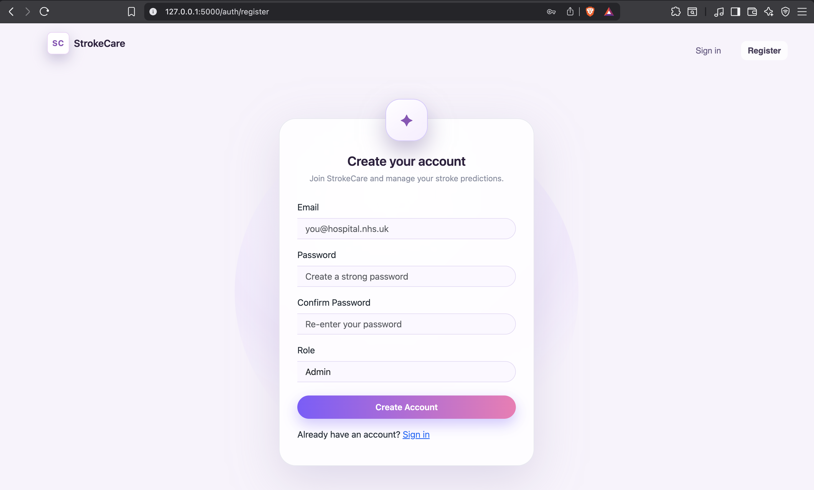

#### Purpose
The registration process ensures that only verified users with an assigned role can access sensitive system features.

#### How to Register
1. Open the **Register** page from the navigation bar.
2. Enter a valid professional email address.
3. Create a strong password and confirm it.
4. Select an appropriate user role (Admin, Doctor, or HCP).
5. Click **Create Account** to complete registration.

#### Key Characteristics
- Passwords are never stored in plain text and are securely hashed.
- Mandatory field validation prevents incomplete or incorrect submissions.
- Role selection determines the level of access granted after login.
- CSRF protection prevents unauthorised form submissions.

The registration page establishes the foundation for secure, role-based access throughout the system.

---

### 6.1.2 User Login Page

The Login page allows registered users to securely sign in and access the StrokeCare platform.

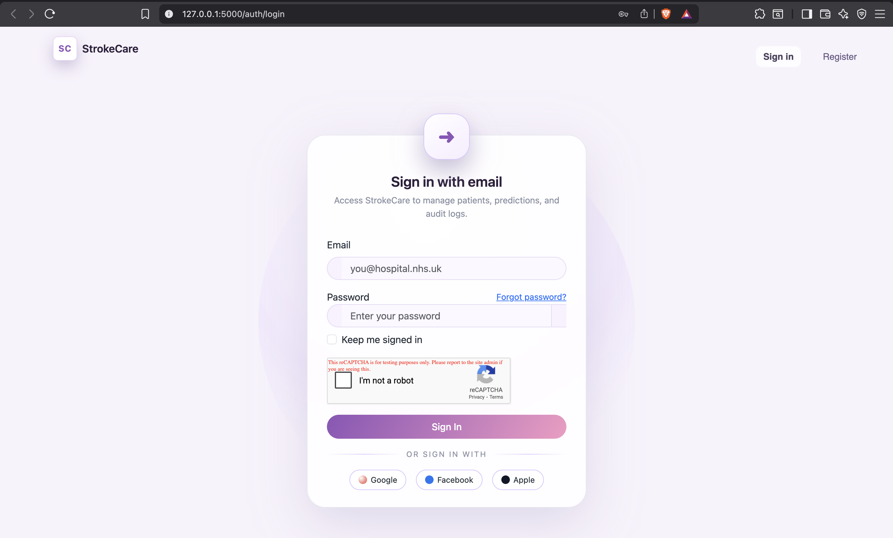

#### Purpose
The login process verifies user identity and ensures access is granted only to authorised users.

#### How to Log In
1. Navigate to the **Sign In** page.
2. Enter your registered email address.
3. Enter your password.
4. Complete the CAPTCHA verification.
5. Click **Sign In** to access the system.

#### Key Characteristics
- Secure session handling protects against unauthorised access.
- CAPTCHA verification reduces automated or malicious login attempts.
- Invalid login attempts are handled safely without revealing system details.
- Users are automatically redirected to their role-specific dashboard after successful login.

---

### 6.1.3 Role-Based Access After Authentication

After successful login, users are redirected based on their assigned role:

- **Admins** are directed to the Admin Dashboard for system management and monitoring.
- **Doctors** can access patient records and view stroke risk predictions.
- **HCPs (Healthcare Professionals)** have restricted, role-appropriate access to support clinical workflows.
- **Patients** do not access the system directly and benefit indirectly through secure data handling and improved clinical decision-making.

This role-based authentication model enforces the principle of **least privilege**, ensuring data confidentiality and system security.

---

## 6.2 Admin Features and Administration Panel

The Admin section of StrokeCare is designed to provide **full system oversight**, allowing authorised administrators to manage users, monitor activity, maintain patient records, and review system-wide analytics.

---

### 6.2.1 Admin Dashboard Overview

The Admin Dashboard provides a high-level summary of system activity and usage.

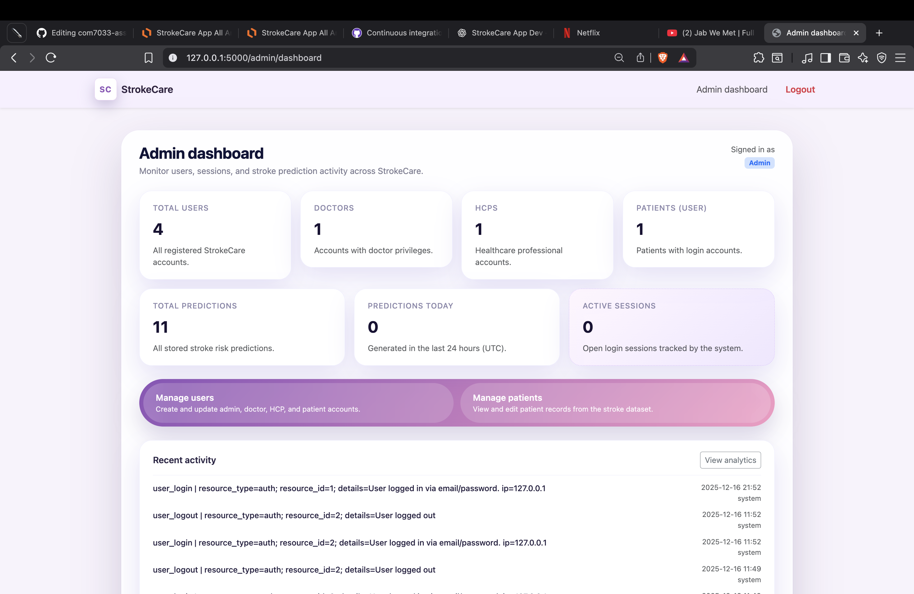

From this dashboard, administrators can:
- View the **total number of registered users**
- See how many users belong to each role (Admin, Doctor, HCP, Patient)
- Monitor the **total number of stroke risk predictions**
- Check recent system activity such as logins and logouts
- View the number of **active user sessions**

---

### 6.2.2 User Management

The User Management page allows administrators to manage all StrokeCare user accounts.

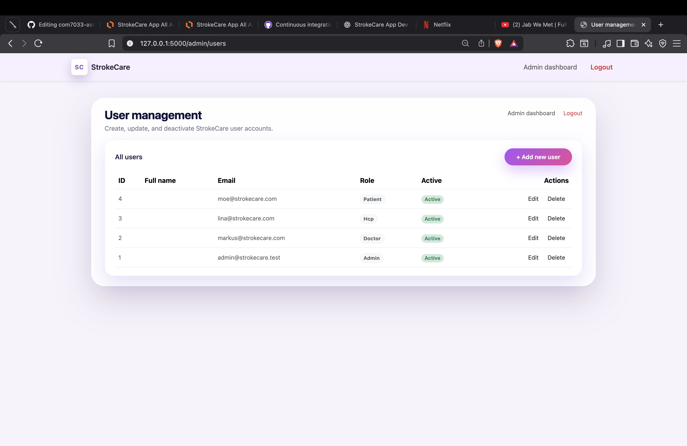

Administrators can:
- View all registered users in a single table
- See each user’s email address, assigned role, and active status
- Add new users using the **Add new user** button
- Edit existing user details (such as role or account status)
- Delete or deactivate accounts when access is no longer required

---

### 6.2.3 Patient Management (Admin Access)

Administrators also have access to patient records stored in the system for oversight and auditing purposes.

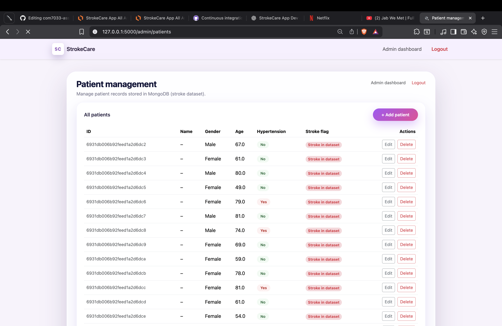

From this page, administrators can:
- View all patient records stored in MongoDB
- See key patient attributes such as age, gender, and hypertension status
- Identify whether a patient is flagged as having had a stroke in the dataset
- Edit or delete patient records if necessary
- Add new patient records using the **Add patient** option

---

### 6.2.4 Adding a New Patient Record

Administrators can manually add patient records using a structured form.

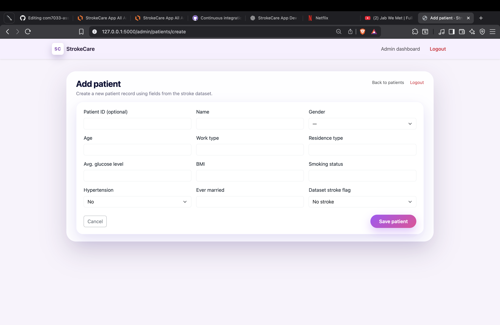

The form includes fields such as:
- Demographic details (age, gender, residence type)
- Lifestyle factors (smoking status, work type)
- Medical indicators (BMI, glucose level, hypertension)
- Dataset stroke flag (used for model training reference)

All inputs are validated before being saved, ensuring data consistency and integrity.

---

### 6.2.5 Analytics and Model Insights

The Analytics & Model Insights page provides visual summaries of system usage and prediction outcomes.

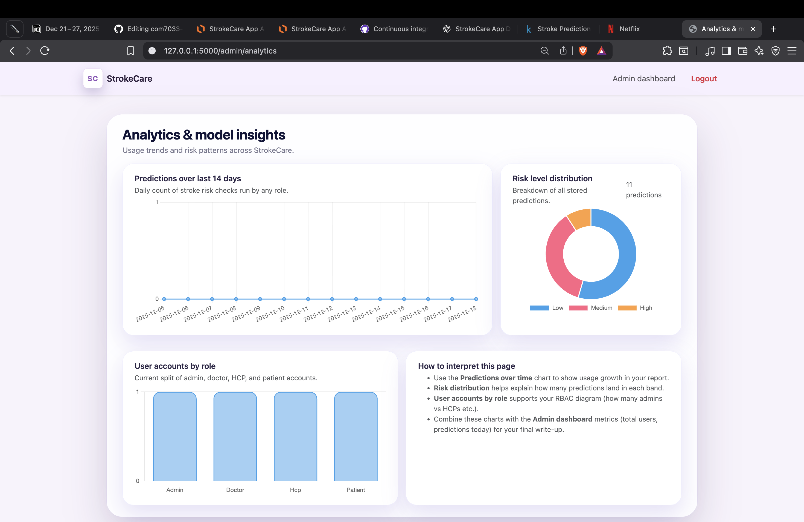

This section allows administrators to:
- Track the number of stroke risk predictions over time
- View the distribution of predicted risk levels (Low, Medium, High)
- Review the number of user accounts by role
- Understand how the system is being used across different user groups

---

### 6.2.6 Security and Administrative Responsibility

All Admin features are protected by:
- Role-based access control
- Secure session handling
- Input validation and confirmation prompts
- Restricted access to sensitive actions such as deletion

Administrators are responsible for maintaining system integrity, ensuring appropriate access, and supporting compliance with secure software development practices.

---

### Summary

The Admin module provides comprehensive control and visibility over the StrokeCare platform. By combining user management, patient oversight, and analytics, it enables administrators to manage the system responsibly while maintaining high standards of security, accountability, and usability.

## 6.3 Doctor Features and Clinical Workflow

The Doctor role in StrokeCare is designed to support day-to-day clinical decision-making by providing secure access to patient records, stroke risk predictions, and analytical insights. Doctors can manage their patient caseload, identify high-risk individuals, and run new stroke risk assessments using the integrated prediction tool.

---

### 6.3.1 Doctor Dashboard Overview

The Doctor Dashboard provides a personalised overview of clinical activity.

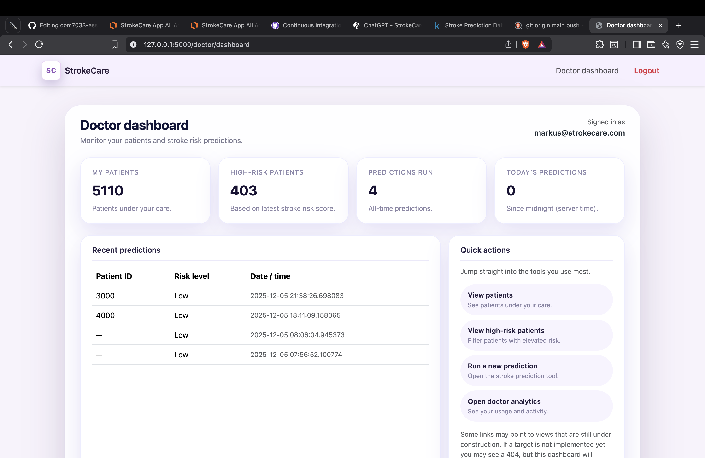

From this dashboard, doctors can:
- View the total number of patients under their care
- See how many patients are currently classified as high risk
- Track how many stroke risk predictions they have run
- View predictions generated on the current day
- Review a table of recent prediction activity

Quick action buttons allow doctors to immediately:
- View all patients
- View only high-risk patients
- Run a new stroke risk prediction
- Access personal analytics and activity summaries

This dashboard acts as the central hub for clinical interactions within StrokeCare.

---

### 6.3.2 Patient List and Search

The Patients page allows doctors to view and manage patient records imported from the stroke dataset.

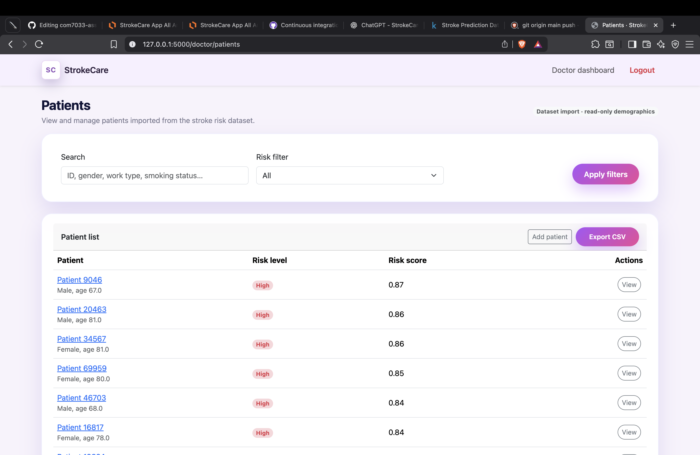

Doctors can:
- View a structured list of patients along with their risk level and risk score
- Search patients using attributes such as ID, gender, work type, or smoking status
- Navigate directly to an individual patient’s detailed record

This enables efficient patient lookup and prioritisation in clinical workflows.

---

### 6.3.3 Risk Filtering and High-Risk Patients

Doctors can filter patients based on stroke risk level using the **Risk filter** option.

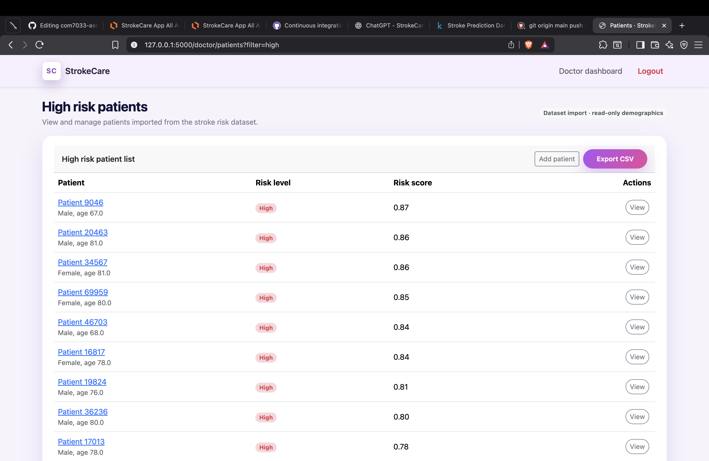

Key capabilities include:
- Filtering patients by Low, Medium, or High risk
- Viewing a dedicated **High Risk Patients** list
- Quickly identifying patients requiring immediate attention

This feature helps clinicians focus on patients with elevated stroke risk and supports proactive intervention.

---

### 6.3.4 Exporting Patient Data (CSV)

The patient list supports exporting filtered data as a CSV file.

Doctors can:
- Apply search and risk filters
- Click **Export CSV** to download the currently displayed patient data
- Use exported data for offline review, reporting, or audit purposes

The exported file reflects the active filters, ensuring that only relevant patient records are included.

---

### 6.3.5 Adding a New Patient Record

Doctors can add new patients to their caseload using a structured input form.

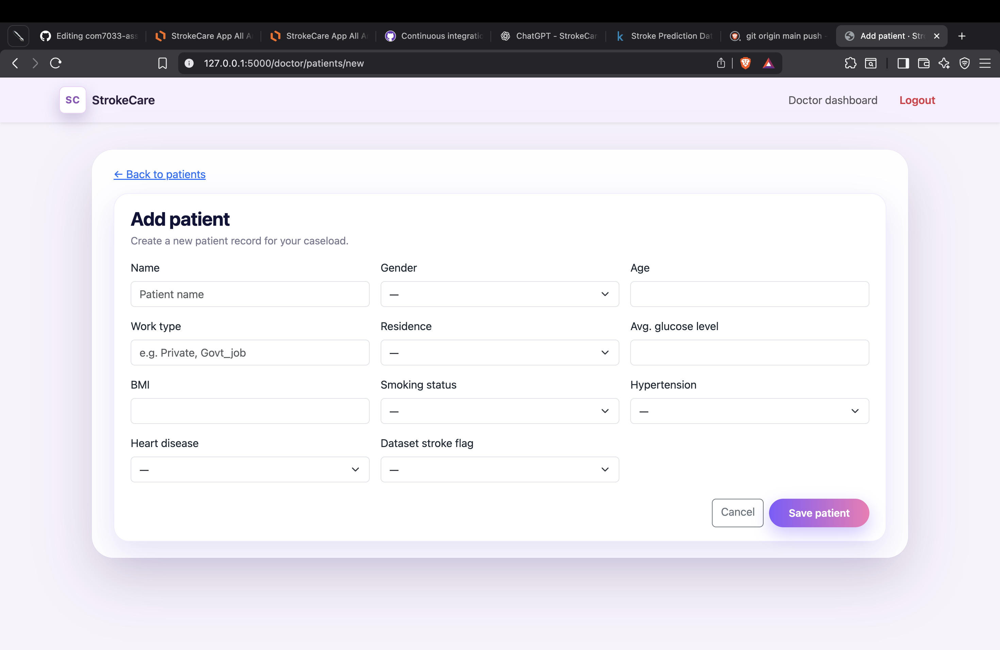

The form captures:
- Demographic information (name, age, gender, residence)
- Lifestyle factors (smoking status, work type)
- Medical indicators (BMI, glucose level, hypertension, heart disease)
- Dataset stroke flag (for reference and validation)

All inputs are validated before submission to ensure data quality and consistency.

---

### 6.3.6 Viewing and Managing an Individual Patient Record

Each patient record includes a detailed, read-only view of imported demographic and medical data.

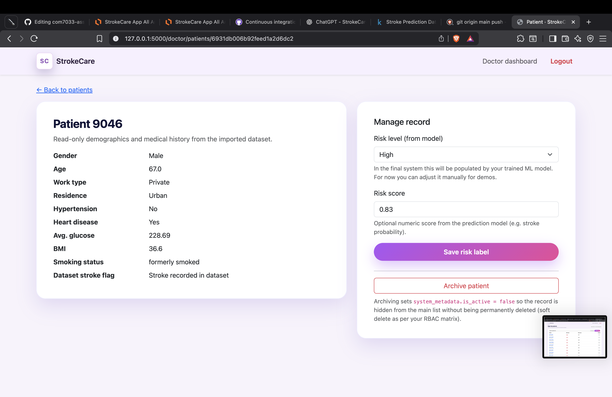

Doctors can:
- Review patient history and risk factors
- View the model-generated risk level and numeric risk score
- Update the risk label where appropriate (for demonstration or review purposes)
- Archive patient records using a soft-delete mechanism

Archiving hides the patient from active lists without permanently deleting the record, supporting safe data management.

---

### 6.3.7 Running a New Stroke Risk Prediction

Doctors can manually run a stroke risk assessment using the prediction tool.

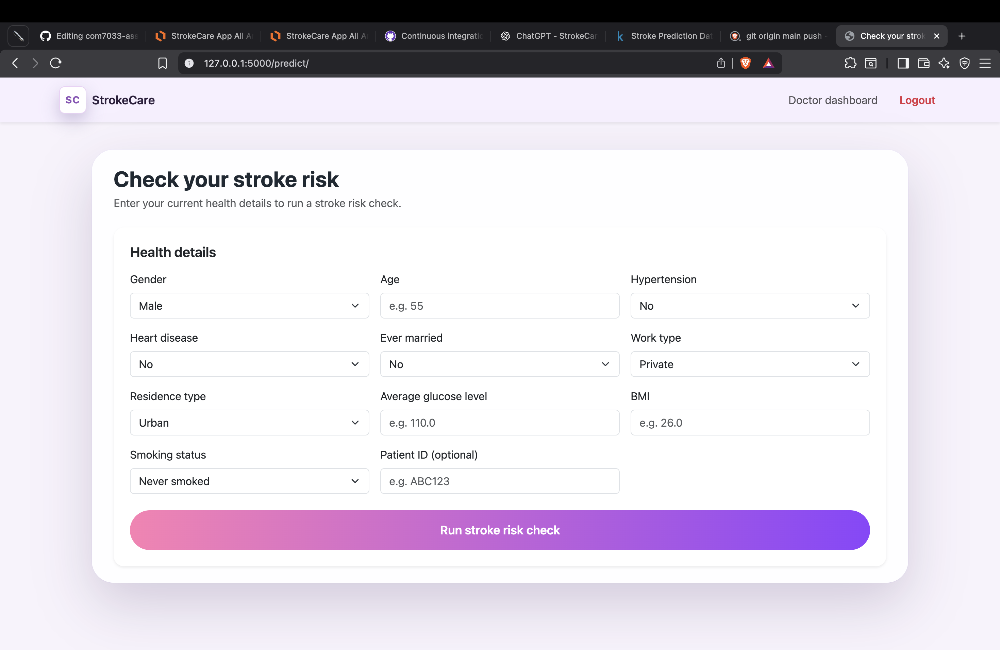

To run a prediction:
1. Enter the patient’s health and lifestyle details.
2. Optionally provide a patient identifier.
3. Click **Run stroke risk check**.

The system processes the input using the trained machine learning model and returns:
- A predicted risk category (Low, Medium, or High)
- An associated numeric risk score

This tool supports clinical assessment and early risk identification.

---

### 6.3.8 Doctor Analytics and Activity

The Analytics & Activity page provides doctors with a personal summary of their system usage.

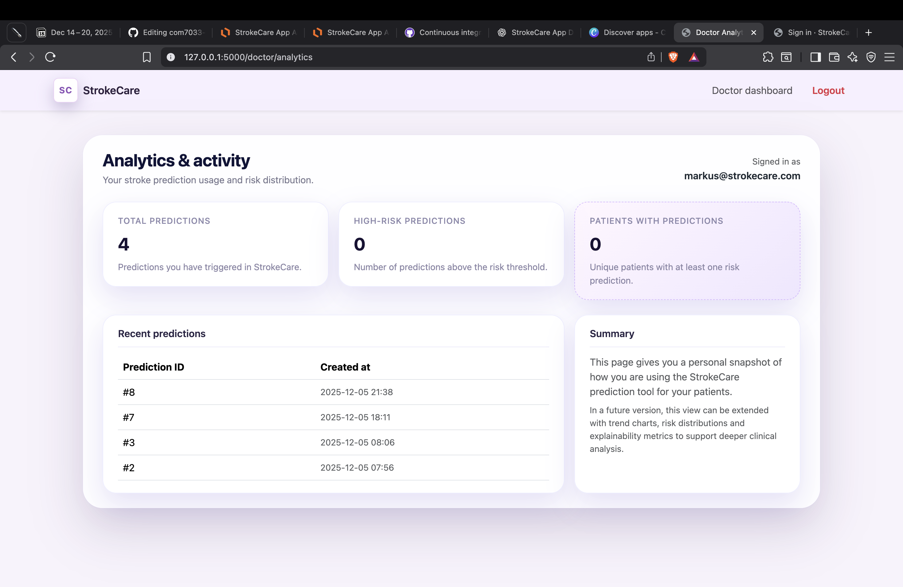

This page displays:
- Total predictions triggered by the doctor
- Number of high-risk predictions
- Count of patients with at least one prediction
- A table of recent prediction timestamps

These insights help doctors understand their usage patterns and clinical activity within StrokeCare.

---

### Summary

The Doctor module is designed to balance usability and clinical responsibility. By combining patient management, risk filtering, prediction tools, and export functionality, StrokeCare supports informed decision-making while maintaining strong security and role-based access controls.

## 6.4 Healthcare Professional (HCP) Features and Clinical Workflow

The Healthcare Professional (HCP) role in StrokeCare is designed to support day-to-day patient care activities while maintaining strict role-based access controls. HCPs assist doctors by managing assigned patients, completing routine care tasks, monitoring risk alerts, and documenting observations, without direct access to administrative or model-level controls.

---

### 6.4.1 HCP Dashboard Overview

The HCP Dashboard provides an operational overview of patient care responsibilities.


From this dashboard, HCPs can:
- View the total number of patients assigned to their care
- See how many assigned patients are currently classified as high risk
- Track tasks scheduled for the current shift
- Review care notes awaiting doctor review

Quick action buttons allow HCPs to immediately:
- View assigned patients
- View high-risk patients
- Open today’s task list
- Access monitoring and alert summaries

This dashboard acts as the central workspace for healthcare professionals during clinical shifts.

---

### 6.4.2 Assigned Patient List and Search

The **Assigned Patients** page allows HCPs to view patients currently under their care.

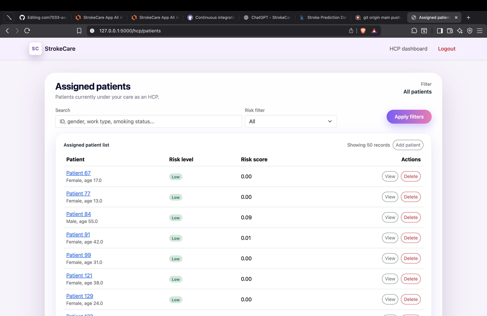

HCPs can:
- View a structured list of assigned patients
- See each patient’s stroke risk level and numeric risk score
- Search patients using attributes such as ID, gender, work type, or smoking status
- Navigate to an individual patient’s detailed care view

This enables efficient patient lookup and prioritisation in daily workflows.

---

### 6.4.3 Risk Filtering and High-Risk Patients (HCP)

HCPs can filter assigned patients based on stroke risk level.

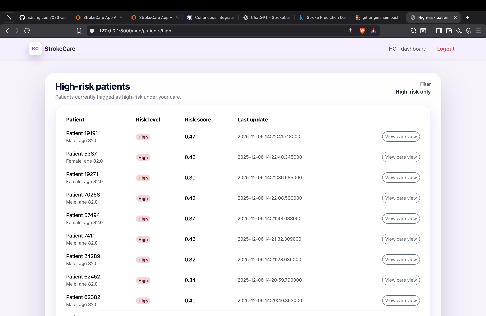

Key capabilities include:
- Filtering patients by Low, Medium, or High risk
- Viewing a dedicated **High-Risk Patients** list
- Quickly identifying patients requiring closer monitoring or escalation

All risk levels and scores are generated using the trained machine learning model, ensuring consistency with doctor-facing views.

---

### 6.4.4 Adding a New Patient Record (HCP)

HCPs are permitted to add new patient records under their care using a structured input form.


The form captures:
- Demographic information (name, age, gender, residence)
- Lifestyle indicators (smoking status, work type)
- Medical factors (BMI, glucose level, hypertension, heart disease)
- Dataset stroke flag (for reference and validation)

All inputs are validated before submission to ensure data quality and consistency.

---

### 6.4.5 Patient Care View

Each assigned patient includes a dedicated **Patient Care View**.

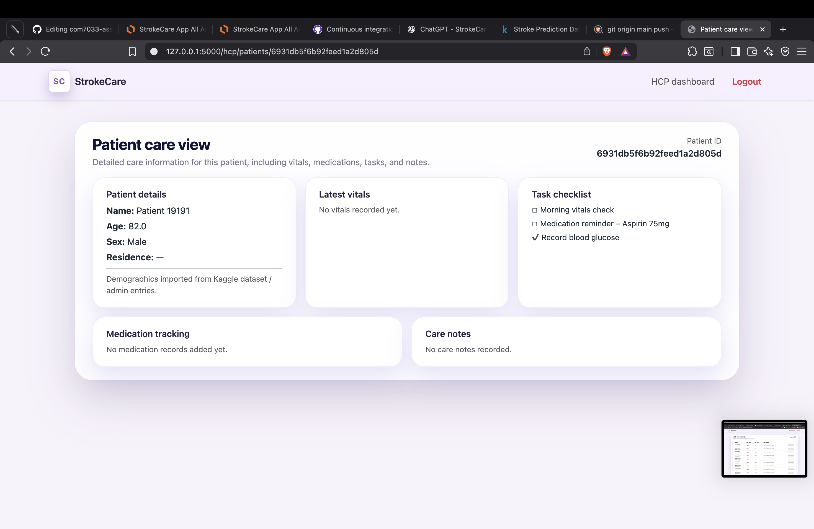

From this view, HCPs can:
- Review patient demographics and identifiers
- View the latest recorded vitals
- Track medication-related tasks
- Complete daily care checklists
- Add care notes for doctor review

This view supports continuity of care across shifts and between clinical staff.

---

### 6.4.6 Daily Task Management

The **Today’s Tasks** page provides HCPs with a checklist of assigned care activities.

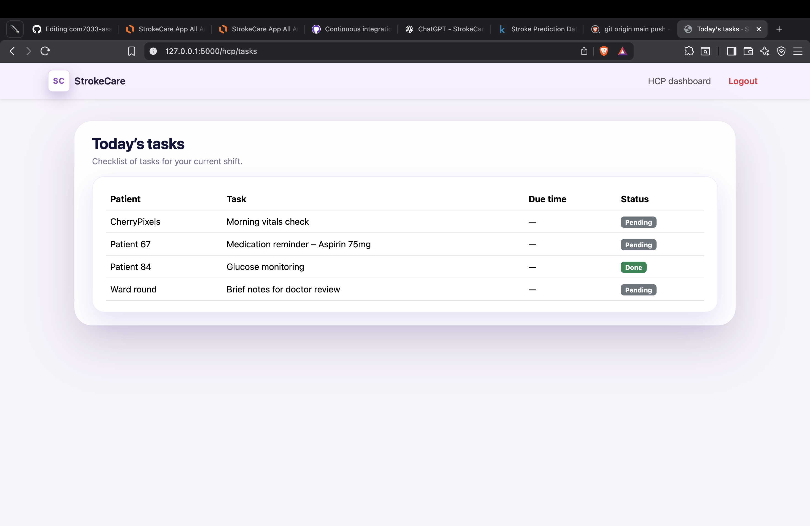

Tasks may include:
- Vital checks
- Medication reminders
- Blood glucose monitoring
- Preparation of notes for doctor review

Each task includes a status indicator (Pending / Done), supporting accountability and shift handover clarity.

---

### 6.4.7 Monitoring and Alerts

The **Monitoring & Alerts** page helps HCPs identify emerging risks and trends.

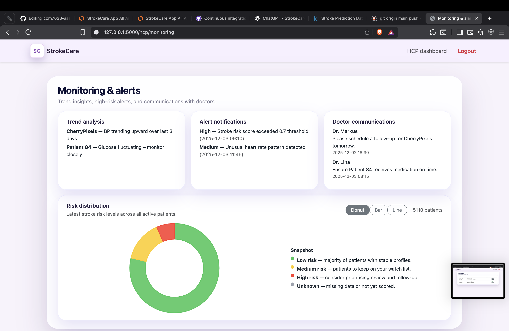

This page displays:
- Patient trend insights (e.g. blood pressure or glucose changes)
- Automated alert notifications for elevated risk thresholds
- Communications and instructions from doctors
- Stroke risk distribution visualisations with chart-type switching

---

### 6.4.8 Machine Learning–Driven Risk Scores (HCP)

All stroke risk levels and numeric scores displayed to HCPs are generated using the trained machine learning model.

- Risk scores are calculated dynamically
- Filters update patient lists in real time
- HCPs cannot modify prediction outputs

This ensures clinical consistency and prevents unauthorised manipulation of model results.

---

### 6.4.9 Security and Role-Based Access Control (HCP)

HCP access is governed by role-based access control (RBAC).

HCP users:
- Can view and manage assigned patients only
- Cannot access administrative dashboards
- Cannot modify machine learning models or analytics

All actions are protected through secure session handling, input validation, and server-side access checks.

---

### Summary

The HCP module focuses on operational efficiency, patient monitoring, and task coordination. By combining real-time risk insights, structured workflows, and strict access controls, StrokeCare enables healthcare professionals to support clinical decision-making while maintaining strong security boundaries.

## 6.5 Patient Features and Self-Service Workflow

The Patient role in StrokeCare is designed to provide individuals with secure, read-only access to their own stroke risk information. Patients can view their latest risk assessments, track historical predictions, review personal profile details, and access educational content. This role supports transparency and patient awareness while ensuring that clinical decision-making remains with healthcare professionals.

---

### 6.5.1 Patient Dashboard Overview

The Patient Dashboard provides a clear summary of the user’s current health risk status.

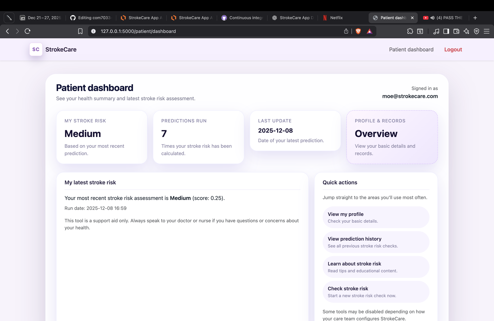

From this dashboard, patients can:
- View their latest stroke risk category (Low, Medium, or High)
- See how many stroke risk assessments have been run
- Check the date of the most recent prediction
- Access a summary of their personal records

Quick action buttons allow patients to:
- View their profile details
- Review stroke risk history
- Run a new stroke risk assessment
- Access educational content about stroke prevention

This dashboard acts as the primary entry point for patient interaction with StrokeCare.

---

### 6.5.2 Viewing Personal Profile Information

Patients can view their basic account information through the **My Profile** page.

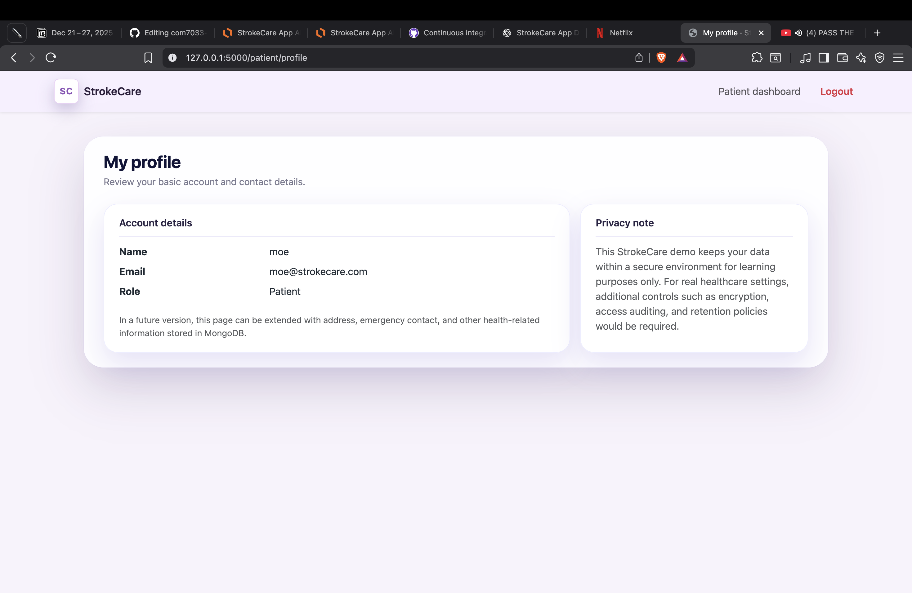

Displayed information includes:
- Name
- Registered email address
- Assigned role (Patient)

This page is read-only and ensures that patients can verify their stored details while preventing unauthorised data modification. A privacy notice highlights that the system is a demonstration environment and not a production healthcare platform.

---

### 6.5.3 Stroke Risk Assessment History

The **My Stroke Assessments** page provides a historical view of all stroke risk predictions run for the patient.

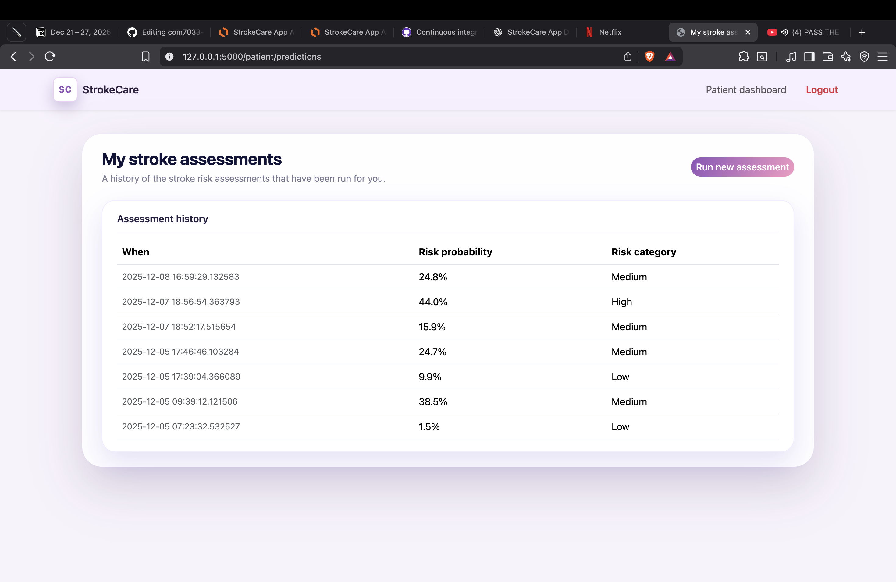

Patients can:
- View timestamps of previous assessments
- See numeric risk probabilities
- Review associated risk categories (Low, Medium, High)

This feature supports transparency and allows patients to observe trends in their stroke risk over time.

---

### 6.5.4 Running a New Stroke Risk Assessment

Patients can initiate a new stroke risk check using the prediction form.

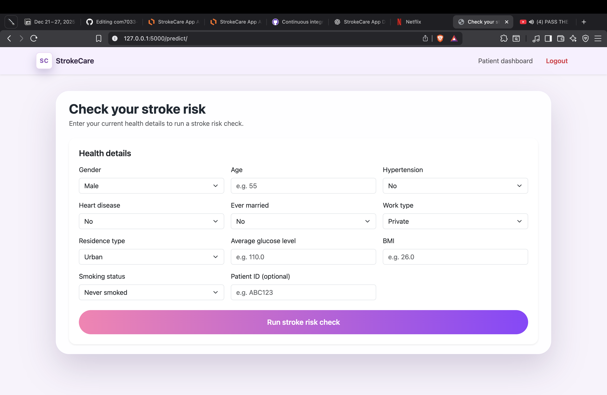

To run an assessment, patients:
1. Enter current health and lifestyle details
2. Provide demographic and medical indicators such as age, BMI, glucose level, and smoking status
3. Click **Run stroke risk check**

The system processes the input using the trained machine learning model and returns:
- A predicted risk category
- A numeric probability score

A disclaimer clearly states that predictions are informational only and do not replace professional medical advice.

---

### 6.5.5 Educational Content and Risk Awareness

The **Learn About Stroke** page provides accessible educational material to help patients understand stroke and its risk factors.

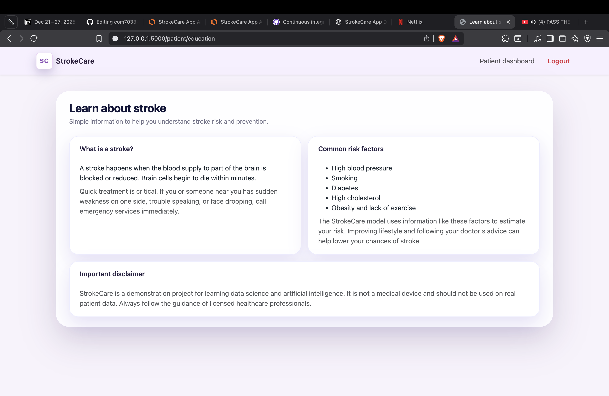

This page includes:
- A simple explanation of what a stroke is
- Common risk factors such as high blood pressure, smoking, diabetes, and obesity
- Guidance on recognising emergency stroke symptoms
- A clear disclaimer reinforcing the educational purpose of the platform

This content supports patient awareness without providing diagnostic or treatment advice.

---

### 6.5.6 Machine Learning Transparency for Patients

Patients are shown stroke risk results generated by the same trained machine learning model used by doctors and HCPs.

- Risk categories are derived from numeric probability thresholds
- Patients cannot modify predictions or clinical records
- All calculations are performed server-side

This ensures consistency across roles while maintaining appropriate access restrictions.

---

### 6.5.7 Security and Role-Based Access Control (Patient)

Patient access is strictly limited through role-based access control (RBAC).

Patients:
- Can only view their own data
- Cannot access other patient records
- Cannot modify clinical or administrative information
- Cannot access analytics or system configuration

All interactions are protected by secure authentication, session management, and server-side authorisation checks.

---

### Summary

The Patient module prioritises transparency, usability, and safety. By providing controlled access to personal risk information, historical assessments, and educational resources, StrokeCare empowers patients while maintaining strict boundaries around clinical responsibility and system security.


